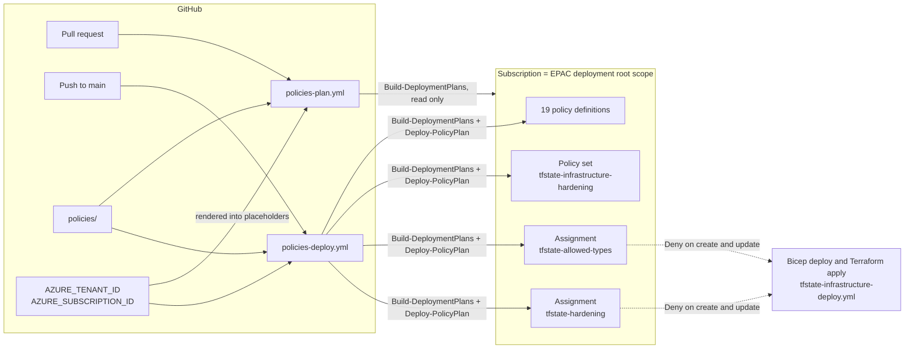

# Azure Policy for the State Subscription — How It Works

Scope: how the `policies/` folder, the two `policies-*` workflows and the two `epac-*` composite actions turn this repository into the single source of Azure Policy for the subscription that holds the Terraform state infrastructure. It covers the Enterprise Policy as Code (EPAC) mechanics, the allow-list policy, every hardening policy, the assignments, the pipelines, the identities they use, and how the policies interact with the Bicep and Terraform deployments.

For the infrastructure the policies protect, see [tfstate-infrastructure.md](tfstate-infrastructure.md). For the identities the workflows sign in as, see [service-principal-setup.md](service-principal-setup.md). The short, folder-level guide is [policies/README.md](../policies/README.md); this document is the long version.

---

## 1. Overview

The subscription is locked down in two layers, both enforced by Azure Policy at the subscription scope and both deployed from this repository:

- **One allow-list policy.** Every resource type that `infrastructure/` (Bicep and Terraform) does not deploy is denied. Nothing else can be created in the subscription, not even by an Azure service on its own initiative.
- **A hardening baseline.** For each allowed resource type, one policy per control denies any configuration that differs from the secure settings the infrastructure already uses (HTTPS and TLS 1.2, no shared keys, no public access, versioning and soft delete, Log Analytics only, email-only action groups, allowed roles, tags, locations and so on).

EPAC is the deployment engine. It is a PowerShell module that reads a folder of JSON files (policy definitions, policy sets, assignments, exemptions), compares it with what is deployed at a *deployment root scope*, writes a plan, and applies the plan. It is a **desired state** tool: what is in the folder exists in Azure, what is not in the folder is removed.



Nothing is deployed from a pull request. The pull request run only builds the plan and shows it; the merge to `main` deploys.

---

## 2. Repository layout

| Path | Purpose |
|---|---|
| `policies/global-settings.jsonc` | EPAC settings: `pacOwnerId`, the `tfstate-subscription` environment, deployment root scope, desired-state strategy, telemetry opt-out. |
| `policies/policyDefinitions/tfstate-allowed-resource-types.jsonc` | The allow-list policy (section 4). |
| `policies/policyDefinitions/tfstate-*.jsonc` | Eighteen hardening policies, one control each (section 5). |
| `policies/policySetDefinitions/tfstate-infrastructure-hardening.jsonc` | Policy set (initiative) that bundles the hardening policies and exposes one effect parameter per policy plus the value parameters (section 6). |
| `policies/policyAssignments/tfstate-allowed-resource-types.jsonc` | Assigns the allow-list policy to the subscription. |
| `policies/policyAssignments/tfstate-hardening.jsonc` | Assigns the policy set to the subscription and fixes every effect. |
| `policies/policyExemptions/tfstate-subscription/` | Exemptions for the environment. Empty today; the README inside shows the format. |
| `policies/README.md` | Folder-level guide. |
| `.github/workflows/policies-plan.yml` | Pull request workflow: validate, build the EPAC plan, publish it (section 7). |
| `.github/workflows/policies-deploy.yml` | Push-to-main workflow: validate, build a fresh plan, deploy it (section 7). |
| `.github/actions/epac-setup/` | Composite action: installs pinned EPAC and Az PowerShell modules (section 8). |
| `.github/actions/epac-definitions/` | Composite action: renders the placeholders into a temp copy and validates the files (section 8). |

The `Output/` folder EPAC writes when run by hand is ignored by git.

---

## 3. EPAC mechanics

### Definitions root and what EPAC reads

`policies/` is the EPAC *definitions root* (the folder EPAC calls `Definitions` by default; the workflows pass it as `-DefinitionsRootFolder`). EPAC reads:

- `global-settings.jsonc` at the root;
- every `*.json` and `*.jsonc` file under `policyDefinitions/`, `policySetDefinitions/` and `policyAssignments/` (recursively);
- every `*.json`, `*.jsonc` and `*.csv` file under `policyExemptions/<pacSelector>/`.

Everything else, including the README files, is ignored. Files are `.jsonc` so they can carry comments; EPAC and PowerShell 7 accept them.

### `global-settings.jsonc`

| Setting | Value | Why |
|---|---|---|
| `pacOwnerId` | a fixed GUID | EPAC writes it into `metadata.pacOwnerId` of everything it deploys and uses it to recognise its own resources. **Never change it** after the first deployment; EPAC would treat its own resources as foreign. |
| `telemetryOptOut` | `true` | EPAC's usage telemetry works by creating an empty `Microsoft.Resources/deployments` resource named `pid-<guid>` at the root scope on every run. The read-only plan identity cannot do that, and the deploy identity should not leave side effects outside the plan. |
| `pacEnvironments[0].pacSelector` | `tfstate-subscription` | The name of the one EPAC environment. It is the `-PacEnvironmentSelector` the workflows pass, the key under `scope` in every assignment, and the sub-folder name under `policyExemptions/`. |
| `cloud`, `tenantId` | `AzureCloud`, `__AZURE_TENANT_ID__` | EPAC refuses to run if the signed-in Az context is in another cloud or tenant. |
| `deploymentRootScope` | `/subscriptions/__AZURE_SUBSCRIPTION_ID__` | Where definitions and the policy set are created, and the root of everything EPAC manages. Assignments can target this scope or any resource group below it. |
| `defaultContext` | `__AZURE_SUBSCRIPTION_ID__` | Pins the Az context to the target subscription instead of the first subscription the identity happens to see. |
| `desiredState.strategy` | `full` | See below. |
| `desiredState.keepDfcSecurityAssignments`, `keepDfcPlanAssignments` | `true` | Defender for Cloud assigns "Microsoft cloud security benchmark" and per-plan policies by itself. Keeping them means enabling Defender never fights with this repository. |
| `managedIdentityLocation` | `westeurope` | Required by the schema. Only DeployIfNotExists and Modify policies create a managed identity; there are none here, so it is never used. |

### Placeholders

Tenant and subscription IDs are not committed. `global-settings.jsonc` and both assignment files contain the literal strings `__AZURE_TENANT_ID__` and `__AZURE_SUBSCRIPTION_ID__`. The `epac-definitions` action copies `policies/` to `$RUNNER_TEMP/epac/Definitions` and replaces them with the values of the `AZURE_TENANT_ID` and `AZURE_SUBSCRIPTION_ID` repository variables (under `act`, with the host's active subscription). EPAC only ever sees the rendered copy; the checkout is never modified. This mirrors how the infrastructure workflows keep IDs in repository variables.

### Desired state: `strategy: full`

With `full`, EPAC owns every policy resource at the subscription and in its resource groups:

- Definitions, policy sets, assignments and exemptions in `policies/` are created or updated to match the files.
- Policy resources that exist in Azure but not in the folder are **deleted**, provided they carry no `pacOwnerId` (portal- or CLI-created) or carry this repository's `pacOwnerId` (left over from an earlier version of the folder).
- Resources with a *different* `pacOwnerId` (another EPAC repository) are never touched. Defender for Cloud assignments are kept because of the two `keepDfc*` settings.
- Assignments inherited from management groups above the subscription are outside the root scope and are not managed.

The pull request plan lists every deletion before it can be merged. Use `ownedOnly` while adopting a subscription that still contains policy resources you want to keep; EPAC then manages only what it created.

The committed `policyExemptions/tfstate-subscription/` folder matters for the same reason: with the folder present, EPAC manages exemptions for the environment and deletes any exemption created in the portal. Without the folder, exemptions would be left alone.

### Plan and deploy commands

| Command | Identity | What it does |
|---|---|---|
| `Build-DeploymentPlans` | plan (read) or apply | Signs in with the existing Az context, checks cloud and tenant, lists the resource groups (Azure Resource Graph), reads the deployed definitions, sets, assignments, exemptions and role assignments at the root scope, compares them with the files and writes `plans-tfstate-subscription/policy-plan.json` (and `roles-plan.json` when managed identities need role assignments). No plan file means no changes. |
| `Deploy-PolicyPlan` | apply | Applies `policy-plan.json`: definitions and policy sets first, then assignments and exemptions, deletions last. |
| `Deploy-RolesPlan` | apply | Applies `roles-plan.json`. Never produces anything here because every policy is `Deny`. |

All three run with `-DefinitionsRootFolder` (the rendered copy), `-OutputFolder` / `-InputFolder` (`$RUNNER_TEMP/epac/Output`) and `-PacEnvironmentSelector tfstate-subscription`. `-DetailedOutput` makes the plan step print a line-by-line diff of changed resources, similar to `terraform plan`.

---

## 4. The allow-list policy

`policyDefinitions/tfstate-allowed-resource-types.jsonc` is the one policy that says what may exist. Assigned as `tfstate-allowed-types` at the subscription with effect `Deny`.

### Mode `All`

Azure Policy evaluates resources in one of two Resource Manager modes. `Indexed` covers only resource types that support tags and location, which is what the built-in "Allowed resource types" uses. `All` also covers child resources (blob services, containers, backup policies and instances), extension resources (role assignments, locks, diagnostic settings), resource groups, deployments and the subscription itself. The allow-list runs in mode `All`, so it is a true allow-list; the built-in would silently ignore everything a storage account, a backup vault or a Bicep deployment creates underneath.

The subscription resource (`Microsoft.Resources/subscriptions`) is excluded by an explicit condition: it cannot be "created", and without the exclusion it would show as non-compliant forever.

### The list

The default value of the `allowedResourceTypes` parameter is derived from `infrastructure/`:

| Resource type | Created by |
|---|---|
| `Microsoft.Resources/deployments` | `az deployment sub create` in the deploy workflow (subscription-scope deployment), and the nested deployment the `storage` Bicep module produces |
| `Microsoft.Resources/subscriptions/resourceGroups` | `bicep/main.bicep`, adopted by `terraform/main.tf` |
| `Microsoft.Storage/storageAccounts` | `bicep/modules/storage.bicep`, `terraform/modules/storage` |
| `Microsoft.Storage/storageAccounts/blobServices` | the `blobService` resource in Bicep; `blob_properties` in Terraform writes the same resource |
| `Microsoft.Storage/storageAccounts/blobServices/containers` | `containers` in Bicep, `azurerm_storage_container` in Terraform |
| `Microsoft.Storage/storageAccounts/queueServices`, `.../tableServices`, `.../fileServices` | the account's other three services. Nothing uses a queue, table or share, but each service resource exists and `terraform/modules/storage` attaches a diagnostic setting to it |
| `Microsoft.Authorization/roleAssignments` | the Storage Blob Data, Storage Account Contributor and RBAC Administrator assignments in Bicep; the backup vault's Storage Account Backup Contributor in Terraform |
| `Microsoft.Authorization/locks` | the `CanNotDelete` lock in Bicep |
| `Microsoft.OperationalInsights/workspaces` | `terraform/modules/log-analytics` |
| `Microsoft.OperationalInsights/workspaces/tables`, `.../savedSearches` | Azure, inside that workspace: one table schema per built-in table and the LogManagement solution's saved searches |
| `Microsoft.Insights/actionGroups` | `terraform/modules/action-group` |
| `Microsoft.Insights/scheduledQueryRules` | `terraform/modules/scheduled-query-alert` |
| `Microsoft.Insights/diagnosticSettings` | `terraform/modules/storage` (four services), `terraform/modules/backup-vault` |
| `Microsoft.DataProtection/backupVaults`, `.../backupPolicies`, `.../backupInstances` | `terraform/modules/backup-vault` |
| `Microsoft.Authorization/policyDefinitions`, `policySetDefinitions`, `policyAssignments`, `policyExemptions` | `policies/`, so the deploy workflow can keep managing the subscription after the policy is in force |
| `Microsoft.Authorization/policyDefinitions/versions`, `policySetDefinitions/versions` | Azure itself, each time EPAC updates a definition or a policy set |
| `Microsoft.Authorization/roleDefinitions` | `infrastructure/rbac/terraform-plan-whatif-role.json`, created by `scripts/create-service-principals.sh` (the custom What-If role, section 5) |
| `Microsoft.Advisor/recommendations`, `Microsoft.Advisor/configurations` | Azure Advisor, which writes recommendations into every subscription by itself; the configurations hold its opt-outs |
| `Microsoft.Authorization/roleManagementPolicies` | Entra ID: one per role in every subscription, carrying its PIM settings, updated outside any deployment |
| `Microsoft.Consumption/budgets` | Cost Management, when a budget is set on the subscription |
| `Microsoft.Security/pricings`, `Microsoft.Security/settings`, `Microsoft.Security/policies` | Defender for Cloud. They already exist in the subscription, so Deny removes nothing and only reports them as non-compliant; `global-settings.jsonc` keeps Defender's assignments for the same reason |

### Consequences

- **Everything else is denied on create and update.** That includes resource types Azure services write when they are switched on, for example Defender for Cloud auto-provisioning (data collection rules, `Microsoft.Security/*` beyond the three settings types above). For a subscription whose only job is to hold Terraform state, that is the intended posture. To allow such a service, add its types through a pull request. The last nine rows above are exactly that: types Azure or an administrator writes unprompted, where denying buys no protection and only produces errors and non-compliance noise.
- **A new resource type in `infrastructure/` must be added to the list in the same pull request**, otherwise the Bicep deploy or Terraform apply is denied. The Azure error names the assignment (`tfstate-allowed-types`) and the denied type.
- Deny is evaluated on the ARM request, so **data-plane operations are not affected**: reading and writing state blobs continues to work regardless of policy.

---

## 5. Hardening policies

### Design rules

- **One policy per control.** The compliance view and the ARM deny error then say exactly which setting is wrong, and each control has its own effect parameter.
- **`Deny` by default.** Every policy has an `effect` parameter with allowed values `Audit`, `Deny`, `Disabled` and default `Deny`; the policy set and the assignment repeat the default.
- **Built-in rules where they exist.** For secure transfer, TLS, shared keys, public blob access, cross-tenant replication, network default action, required tags and allowed locations, the `policyRule` is the Microsoft built-in's rule (referenced in each file) with the effect fixed to `Deny`. The remaining policies use the same aliases the built-ins use.
- **"Explicitly secure", not "not explicitly insecure".** Where the Azure default is the insecure value, or where the infrastructure sets the property explicitly, a missing property is denied too (shared key access, public blob access, cross-tenant replication, Entra ID defaults, blob data protection). Where the Azure default is already secure and the infrastructure does not set the property, only an explicit bad value is denied (container `publicAccess`, backup vault soft delete, Log Analytics retention).
- **Values are the infrastructure's values.** Retention days, SKUs, tags and locations default to what `infrastructure/` deploys, so the existing Bicep deploy and Terraform apply pass unchanged.
- **Mode.** `All` for every policy that names a resource type in its rule. `Indexed` only for the two policies that have no type condition (required tags, allowed locations on resources), so that child and extension resources without tags or a location are not evaluated; resource groups get their own `All`-mode copies of those two policies, like the built-ins do.

### The policies

| Policy | Type | Rule (denies when...) | Value in `infrastructure/` |
|---|---|---|---|
| `tfstate-storage-secure-transfer` | storage account | `supportsHttpsTrafficOnly` is false (or missing on API versions before 2019-04-01), or `minimumTlsVersion` is missing or not in `allowedMinimumTlsVersions` (`TLS1_2`, `TLS1_3`) | `supportsHttpsTrafficOnly: true`, `minimumTlsVersion: TLS1_2` |
| `tfstate-storage-no-shared-key` | storage account | `allowSharedKeyAccess` is missing, empty or true | `allowSharedKeyAccess: false` |
| `tfstate-storage-no-public-blob-access` | storage account | `allowBlobPublicAccess` is not explicitly false. Container-level `publicAccess` has no policy alias, so this account setting is where anonymous access is denied; with it false, Azure rejects any container that requests public access | `allowBlobPublicAccess: false` |
| `tfstate-storage-no-cross-tenant-replication` | storage account | `allowCrossTenantReplication` is not explicitly false | `allowCrossTenantReplication: false` |
| `tfstate-storage-entra-id-defaults` | storage account | `defaultToOAuthAuthentication` is not true, or `allowedCopyScope` is not `AAD` | both set |
| `tfstate-storage-network-default-deny` | storage account | `networkAcls.defaultAction` is not `Deny` | `networkDefaultAction` in the parameter file; **assignment effect is `Audit`** (below) |
| `tfstate-storage-kind-and-sku` | storage account | `kind` is not `StorageV2`, or `sku.name` is not in `allowedSkus` (`Standard_GZRS`, `Standard_RAGZRS`) | `StorageV2`, `Standard_GZRS` |
| `tfstate-storage-blob-data-protection` | blob service | versioning, change feed, blob soft delete, container soft delete or point-in-time restore is not enabled, or a soft delete retention is below `minimumSoftDeleteRetentionDays` (90) | all enabled, 90 days, restore 30 days |
| `tfstate-log-analytics-retention` | Log Analytics workspace | `retentionInDays` is below `minimumRetentionInDays` (30) | `log_analytics_retention_in_days` (30, validated 30–730) |
| `tfstate-action-group-email-only` | action group | any webhook, SMS, voice, push, ITSM, runbook, logic app, function, ARM role or event hub receiver exists, or an email receiver does not use the common alert schema | email receivers only, `use_common_alert_schema = true` |
| `tfstate-alert-rule-enabled` | log search alert rule | `enabled` is not true | the state access alert is always enabled |
| `tfstate-diagnostic-setting-log-analytics-only` | diagnostic setting | no `workspaceId`, or a `storageAccountId` or `eventHubAuthorizationRuleId` destination exists | all five diagnostic settings target the workspace |
| `tfstate-backup-vault-soft-delete` | backup vault | `securitySettings.softDeleteSettings.state` is `Off` | Azure default `On` |
| `tfstate-role-assignment-allowed-roles` | role assignment | the role definition GUID is not in `allowedRoleDefinitionIds` | the five storage roles Bicep and Terraform assign, plus Reader, Owner, Contributor and User Access Administrator from the identity setup |
| `tfstate-required-tags-resources` (Indexed) | any taggable resource | the tag named by `tagName` is missing. The policy set references it once per tag: `application`, `environment`, `environmentNumber`, `workload`, `managedBy` | `locals.tags` in `main.bicep` and `main.tf` |
| `tfstate-required-tags-resource-groups` | resource group | same, also one reference per tag | same |
| `tfstate-allowed-locations-resources` (Indexed) | any located resource | `location` is not in `allowedLocations` (`westeurope`) and not `global` | `location` in the parameter file; action groups are `global` |
| `tfstate-allowed-locations-resource-groups` | resource group | `location` is not in `allowedLocations` | same |

Why each control matters is written at the top of every definition file, with a pointer to the Bicep or Terraform code that sets the value.

### The one `Audit`

`storageNetworkDefaultDenyEffect` is `Audit` in `policyAssignments/tfstate-hardening.jsonc`. The committed parameter file sets `networkDefaultAction` to `Allow` because GitHub-hosted runners have no stable egress IP ([tfstate-infrastructure.md, State storage network access](tfstate-infrastructure.md#state-storage-network-access)); with `Deny` the next `tfstate-infrastructure-deploy` run would be rejected by policy. The storage account is reported as non-compliant instead. When `networkDefaultAction` is switched to `Deny`, set the effect to `Deny` in the same pull request.

### Role assignments and the custom What-If role

`tfstate-role-assignment-allowed-roles` applies to every scope in the subscription. `infrastructure/scripts/create-service-principals.sh` also assigns the custom role `Terraform Plan What-If Operator`, whose GUID is generated when the role definition is created in the tenant and therefore cannot be part of the committed default. Add it to `allowedRoleDefinitionIds` in the assignment before running the script (or set `roleAssignmentAllowedRolesEffect` to `Audit` for that run):

```bash
az role definition list --name "Terraform Plan What-If Operator" --query "[0].name" -o tsv
```

---

## 6. Policy set and assignments

### Parameter flow

Each control's effect and values travel through three files:

```text
assignment parameter            policy set parameter              policy definition parameter
storageKindAndSkuEffect: Deny -> storageKindAndSkuEffect        -> effect        (tfstate-storage-kind-and-sku)
allowedStorageSkus: [...]     -> allowedStorageSkus             -> allowedSkus
requiredTagsResourcesEffect   -> requiredTagsResourcesEffect    -> effect        (five references, one per tag)
allowedLocations: [...]       -> allowedLocations               -> allowedLocations (both location policies)
```

The policy set (`tfstate-infrastructure-hardening`) references every hardening policy by `policyDefinitionName`; EPAC turns that into the full definition ID at the deployment root scope. Each member has a `policyDefinitionReferenceId` (`storageSecureTransfer`, `alertRuleEnabled`, ...) that exemptions and per-policy non-compliance messages can target. A policy may appear more than once with different parameters: the two tag policies are referenced five times each, once per required tag name, which is why the set has 26 members for 18 definitions.

The assignment lists every effect explicitly, so the enforced posture is reviewable in one file. EPAC drops assignment parameters whose value equals the definition's default before deploying, so in Azure the assignment carries only the values that differ (today: the `Audit` effect above). That is why the plan may show fewer parameters than the file.

### Assignment rules

| Rule | Where it is checked |
|---|---|
| `assignment.name` at most 24 characters (`tfstate-allowed-types`, `tfstate-hardening`) | `epac-definitions` validation, EPAC, Azure |
| `scope` has an entry for the `tfstate-subscription` selector | `epac-definitions` validation; an assignment without it would simply not be deployed |
| `definitionEntry.policyName` / `policySetName` refers to a file in the folder | `epac-definitions` validation, EPAC |
| `enforcementMode: Default` | `DoNotEnforce` would turn every Deny into a report; never use it here except for a deliberate what-if of a new policy |
| `nonComplianceMessages` | One default message per assignment, shown in the ARM deny error next to the policy display name, pointing to `policies/README.md` |

---

## 7. Workflows

### Triggers and concurrency

| Workflow | Trigger | Concurrency group | Cancel in progress |
|---|---|---|---|
| `policies-plan.yml` | `pull_request` with changes under `policies/**`, the workflow itself or `.github/actions/epac-*/**` | `policies-plan-<PR number>` | Yes: a new push to the PR cancels its running plan |
| `policies-deploy.yml` | `push` to `main` with the same paths | `policies-deploy` | No: deploys run one at a time and are never dropped |

Unlike the infrastructure workflows, changes to the pipeline files themselves do trigger a run, so a broken workflow edit shows up in its own pull request. A workflow-only change on `main` results in a deploy run that finds no changes.

### Plan workflow steps

| # | Step | Notes |
|---|---|---|
| 1 | Checkout | |
| 2 | Install Azure CLI and jq | `act` only |
| 3 | **EPAC setup** | `.github/actions/epac-setup`: pinned modules, before any Azure login, so a broken pin fails without touching Azure |
| 4 | Azure login (GitHub OIDC) / Azure login (local host az login) | One or the other, depending on `ACT`. On GitHub `enable-AzPSSession: true` also signs in Az PowerShell, which needs the Az.Accounts module from step 3 |
| 5 | Azure CLI select subscription | Exports `EPAC_TENANT_ID` and `EPAC_SUBSCRIPTION_ID` from `az account show` |
| 6 | Azure PowerShell login (local, from the Azure CLI session) | `act` only: hands the CLI's ARM access token to `Connect-AzAccount -AccessToken` (valid for about an hour) |
| 7 | **EPAC render and validate definitions** | `.github/actions/epac-definitions`: rendered copy in `$RUNNER_TEMP/epac/Definitions`, validation (section 8) |
| 8 | **EPAC build deployment plan** | `Build-DeploymentPlans ... -DetailedOutput`. Writes the job summary (table of new/update/replace/delete per resource kind, one line per resource) and the outputs `policy-changes`, `role-changes`, `output-folder` |
| 9 | Upload deployment plan | Only on GitHub and only when a plan file exists; artifact `epac-plan-tfstate-subscription-pr<number>`, 30 days |

### Deploy workflow steps

Steps 1–8 are the same as the plan workflow, signed in as the apply identity. Then:

| # | Step | Notes |
|---|---|---|
| 9 | Upload deployment plan | Before the deploy steps, so the attempted plan is on record even when a deploy step fails. Artifact `epac-plan-tfstate-subscription-<run number>`, 90 days |
| 10 | **EPAC deploy policy plan** | `Deploy-PolicyPlan`, only when `policy-changes` is `true` |
| 11 | EPAC deploy roles plan | `Deploy-RolesPlan`, only when `role-changes` is `true` (never for Deny-only policies) |

The deploy builds its **own** plan instead of reusing the pull request's artifact: the subscription may have changed between the pull request run and the merge, and the plan the deploy applies must describe the current state. What the pull request showed and what the deploy applies can therefore differ, in which case the deploy's job summary and artifact say so.

Every run of the deploy workflow deploys whatever the fresh plan contains. There is no manual trigger; open a pull request to preview.

### Why the plan is safe to run on pull requests

`Build-DeploymentPlans` only reads. It needs no write permission, creates nothing (telemetry is off, section 3) and writes the plan to the runner's temp folder. The plan identity has Reader on the subscription and nothing else that could change Azure. Pull requests from forks get no OIDC token and cannot run the workflow at all.

---

## 8. Composite actions

### `epac-setup`

| Input | Default | Meaning |
|---|---|---|
| `epac-version` | `11.5.6` | EnterprisePolicyAsCode module version |
| `az-accounts-version` | `5.5.3` | Az.Accounts (`Connect-AzAccount`, `Invoke-AzRestMethod`) |
| `az-resources-version` | `10.2.1` | Az.Resources (policy and role assignment cmdlets) |
| `az-resourcegraph-version` | `1.3.0` | Az.ResourceGraph (EPAC lists resource groups through Resource Graph) |

What it does:

1. Under `act` only, installs PowerShell from the Microsoft apt repository (the `act` images do not ship it).
2. On GitHub only, restores `~/.local/share/powershell/Modules` from `actions/cache`, keyed on the four versions.
3. Installs each module that is not already present in exactly the pinned version with `Install-PSResource -Version "[x.y.z]"` (NuGet syntax for "exactly this version") and `-SkipDependencyCheck`, so the gallery cannot pull a second, unpinned Az.Accounts next to the pinned one. Az.Accounts is installed first because the other modules depend on it.
4. Imports Az.Accounts and EPAC, so a broken module fails here rather than after the Azure login, and writes the module table to the job summary.

### `epac-definitions`

| Input | Default | Meaning |
|---|---|---|
| `source` | `policies` | Definitions root in the repository |
| `tenant-id` | required | Replaces `__AZURE_TENANT_ID__` |
| `subscription-id` | required | Replaces `__AZURE_SUBSCRIPTION_ID__` |
| `pac-environment` | `tfstate-subscription` | The selector that must exist in `global-settings.jsonc` and in every assignment's `scope` |
| `epac-version` | `11.5.6` | The EPAC release tag whose JSON schemas are downloaded for validation (kept equal to the module pin) |

Output: `folder`, the absolute path of the rendered copy.

Validation, before EPAC runs:

1. Both IDs are GUIDs, `global-settings.jsonc` exists, no unknown `__AZURE_*__` placeholder is left after rendering.
2. Every `*.json` / `*.jsonc` file parses (PowerShell 7 reports the offending line).
3. Every file matches the EPAC JSON schema for its folder (`Test-Json` against the schemas of the pinned EPAC release; comments are stripped first because the schema validator does not accept them).
4. `pacEnvironments` contains the selector.
5. Policy definition names are unique and at most 64 characters.
6. Every `policyDefinitionName` in a policy set, and every `policyName` / `policySetName` in an assignment, refers to a file in the folder; `policyDefinitionReferenceId`s in a set are unique.
7. Assignment names are at most 24 characters and every assignment's `scope` has an entry for the selector.

Every error is reported as a GitHub annotation and the step fails with the count. EPAC repeats most of these checks with more context, but only after signing in and reading Azure; this step makes a typo fail in seconds.

---

## 9. Configuration

Nothing new has to be configured. The workflows reuse the repository variables of the infrastructure workflows:

| Variable | Used for |
|---|---|
| `AZURE_PLAN_CLIENT_ID` (falls back to `AZURE_CLIENT_ID`) | OIDC login of `policies-plan.yml` |
| `AZURE_APPLY_CLIENT_ID` (falls back to `AZURE_CLIENT_ID`) | OIDC login of `policies-deploy.yml` |
| `AZURE_TENANT_ID` | OIDC login; rendered into `global-settings.jsonc` |
| `AZURE_SUBSCRIPTION_ID` | OIDC login; rendered into `global-settings.jsonc` and the assignment scopes. Optional under `act` (host's active subscription) |

Values that describe the environment live in the assignment, next to a comment naming the `infrastructure/` input they mirror:

| Assignment parameter | Mirrors |
|---|---|
| `allowedLocations` | `location` in `infrastructure/parameterfiles/tfstate-infrastructure.json` |
| `requiredTagsResourcesEffect`, `requiredTagsResourceGroupsEffect` | the tag names are fixed per reference in the policy set, mirroring `locals.tags` in `bicep/main.bicep` and `terraform/main.tf` |
| `minimumSoftDeleteRetentionDays` | `softDeleteRetentionDays` / `soft_delete_retention_days` |
| `minimumLogAnalyticsRetentionInDays` | `log_analytics_retention_in_days` |
| `allowedStorageSkus` | `skuName` / `replication_type` |
| `allowedRoleDefinitionIds` | roles assigned by `storage.bicep`, `modules/backup-vault` and `create-service-principals.sh` |
| `storageNetworkDefaultDenyEffect` | `networkDefaultAction` in the parameter file (`Allow` → `Audit`, `Deny` → `Deny`) |

Change the assignment parameter and the infrastructure input in the same pull request; both workflows run on it.

---

## 10. Access control

| Workflow | Identity | Role on the subscription | Why it is enough |
|---|---|---|---|
| `policies-plan.yml` | plan (`sp-...-plan`) | Reader (already assigned for Terraform plan) | `Build-DeploymentPlans` reads policy definitions, sets, assignments, exemptions and role assignments (`*/read`), and lists resource groups through Azure Resource Graph, which needs read access to the subscription |
| `policies-deploy.yml` | apply (`sp-...-apply`) | Owner, or Contributor + User Access Administrator (already assigned for the deploy) | EPAC needs Resource Policy Contributor for the policy resources and Role Based Access Control Administrator for managed-identity role assignments; Owner includes both, and so does the Contributor + User Access Administrator pair |

EPAC's own guidance recommends separate service principals for plan, policy deployment and role deployment. This repository already has a read-only and a write identity with OIDC federated credentials for exactly the two triggers (`pull_request`, branch `main`), and every policy is `Deny`, so the two existing identities are reused. The federated credentials, the custom What-If role and the `TERRAFORM_*_PRINCIPAL_ID` variables are unchanged.

The apply identity's Owner assignment, the plan identity's Reader assignment and the custom role assignment are themselves role assignments in the subscription and are subject to `tfstate-role-assignment-allowed-roles` when they are (re)created. Reader, Owner, Contributor and User Access Administrator are in the allow-list; the custom role has to be added (section 5).

---

## 11. Interaction with the infrastructure workflows

- **Order.** Policy assignments only affect create and update requests made after they exist. Deploying the policies first and the infrastructure afterwards is safe, and so is the reverse: existing resources are never changed by a Deny policy, they are only reported as non-compliant if they violate one. A new or changed assignment takes effect within roughly half an hour; the first compliance scan follows later.
- **Every value is already compliant.** The policies were written from the Bicep and Terraform code, so `tfstate-infrastructure-deploy.yml` passes unchanged. The only known non-compliance is the storage firewall default action, which is `Audit` (section 5).
- **When an infrastructure run is denied**, the Azure error contains the assignment name, the policy definition name and the non-compliance message. Either the infrastructure change is wrong (fix it) or the policies need to follow it (change `policies/` in the same or a preceding pull request). The Bicep What-if in the infrastructure plan workflow does **not** evaluate policy, so a policy denial only surfaces at deploy time.
- **A wrong alias fails the policy deploy, not the infrastructure.** Azure validates policy aliases when a definition is created, so a definition with an alias that does not exist fails `Deploy-PolicyPlan` at that definition, and the run log names it. Nothing is enforced until the definition exists.
- **Bicep What-if and `Microsoft.Resources/deployments`.** Both subscription-scope deployments and the nested module deployment are in the allow-list, so the deploy workflow's `az deployment sub create` is not affected by the allow-list.
- **The state access alert stays on.** `tfstate-alert-rule-enabled` denies disabling the alert that is the compensating control for the `Allow` network posture; removing it requires a Terraform change through a reviewed pull request.

---

## 12. Supply chain and dependency pinning

- **EPAC:** `EnterprisePolicyAsCode` is pinned to `11.5.6` in `epac-setup`, and the validation schemas are downloaded from the matching `v11.5.6` tag of the EPAC repository, not from its `main` branch. The `$schema` URLs inside the files point to `main` because that is what the EPAC schemas expect; they are only used by editors.
- **Az modules:** Az.Accounts `5.5.3`, Az.Resources `10.2.1`, Az.ResourceGraph `1.3.0`, installed with exact-version NuGet syntax and without dependency resolution.
- **GitHub Actions:** every `uses:` is pinned to a full commit SHA with a `# vX.Y.Z` comment, and Dependabot's `github-actions` entry covers the new workflows and composite actions.
- **No Dependabot for the PowerShell Gallery.** Bump the module pins by hand; the plan workflow on the bump pull request shows whether a new EPAC version changes the plan.

---

## 13. Running locally

With `act`, the workflow headers show the exact commands. Both reuse the host `az login` the same way the infrastructure workflows do, and the Azure CLI token is handed to Az PowerShell because `azure/login` is skipped under `act`:

```bash
# Preview (pull_request event)
act pull_request -W .github/workflows/policies-plan.yml \
  --container-options "-v $HOME/.azure:/tmp/azure-host:ro"

# Deploys for real (push event)
act push -W .github/workflows/policies-deploy.yml \
  --container-options "-v $HOME/.azure:/tmp/azure-host:ro"
```

By hand, with PowerShell 7.4 or later, render the placeholders into a scratch copy first (never into `policies/` itself):

```powershell
Install-PSResource Az.Accounts, Az.Resources, Az.ResourceGraph, EnterprisePolicyAsCode -Scope CurrentUser
Connect-AzAccount -Tenant <tenant-id> -Subscription <subscription-id>

$rendered = Join-Path ([System.IO.Path]::GetTempPath()) 'epac/Definitions'
Remove-Item $rendered -Recurse -Force -ErrorAction SilentlyContinue
Copy-Item policies $rendered -Recurse
Get-ChildItem $rendered -Recurse -Include *.json, *.jsonc | ForEach-Object {
  (Get-Content $_ -Raw) -replace '__AZURE_TENANT_ID__', '<tenant-id>' -replace '__AZURE_SUBSCRIPTION_ID__', '<subscription-id>' |
    Set-Content $_ -NoNewline
}

Build-DeploymentPlans -DefinitionsRootFolder $rendered -OutputFolder ./Output -PacEnvironmentSelector tfstate-subscription -DetailedOutput
Deploy-PolicyPlan     -DefinitionsRootFolder $rendered -InputFolder ./Output  -PacEnvironmentSelector tfstate-subscription
```

`Output/` is ignored by git. Your identity needs the same roles as the workflow identities (section 10).

---

## 14. Known behaviours and limitations

| Behaviour | Explanation / workaround |
|---|---|
| Azure services that write their own resource types are denied | Mode `All` allow-list. Data collection rules and similar are not in the list; the types Azure writes unprompted (Advisor, PIM role management policies, budgets, Defender settings, workspace tables and saved searches) are. Add the type through a pull request, or add a time-boxed exemption. |
| The first deploy deletes policy resources that were created in the portal | `strategy: full`. The pull request plan lists them; switch to `ownedOnly` in `global-settings.jsonc` to keep them while transitioning. |
| A resource that violated a policy before the policy existed is not changed | Deny only affects create and update requests. The compliance view reports it; fix the resource through Bicep or Terraform. |
| The storage account is reported non-compliant for the network default action | Intended while `networkDefaultAction` is `Allow`; the assignment effect is `Audit` (section 5). |
| The assignment in Azure has fewer parameters than the file | EPAC drops parameters equal to the definition default before deploying. The file is still the reviewable source of truth. |
| `Deploy-PolicyPlan` fails on one definition with an alias error | The alias does not exist for that resource type. List the valid aliases with `az provider show --namespace <Namespace> --expand "resourceTypes/aliases" --query "resourceTypes[?resourceType=='<type>'].aliases[].name"`, fix the file, re-run. Definitions deployed before the failing one stay deployed; assignments are not created until every referenced definition exists. |
| `create-service-principals.sh` fails to assign the custom What-If role | Its GUID is not in `allowedRoleDefinitionIds`. Add it (section 5) and re-run the script; it is idempotent. |
| `Build-DeploymentPlans` fails with "Wrong cloud or tenant logged in" | The identity signed in to another tenant than `AZURE_TENANT_ID`. Under `act`, `az account set --subscription` to a subscription in the right tenant first. |
| `act` run fails after about an hour with an expired token | The Azure CLI token handed to Az PowerShell is not refreshed. Re-run. |
| Pull requests from forks do not run the plan | No OIDC token for forks, same as the infrastructure workflows. |
| Policy assignments made above the subscription are not managed | Management group assignments are outside the deployment root scope; EPAC neither creates nor deletes them. |
| Definitions cannot be shared with other subscriptions | They live at the subscription (the deployment root scope). Moving to a management group root means changing `deploymentRootScope`, the assignment scopes and the identities' role scopes, and EPAC then manages every subscription under that group. |
| Changing `pacOwnerId` | EPAC would consider all its resources foreign and, with `full`, plan to delete and recreate them. Never change it. |

---

## References

- [policies/README.md](../policies/README.md): folder-level guide
- [tfstate-infrastructure.md](tfstate-infrastructure.md): the infrastructure the policies protect
- [service-principal-setup.md](service-principal-setup.md): the plan and apply identities the workflows reuse
- [Enterprise Policy as Code documentation](https://azure.github.io/enterprise-azure-policy-as-code/)
- [EPAC desired state management](https://azure.github.io/enterprise-azure-policy-as-code/settings-desired-state/)
- [Azure Policy definition structure and Resource Manager modes](https://learn.microsoft.com/azure/governance/policy/concepts/definition-structure-basics)
- [Azure Policy effects: Deny](https://learn.microsoft.com/azure/governance/policy/concepts/effect-deny)
- [Built-in policy definitions on GitHub](https://github.com/Azure/azure-policy/tree/master/built-in-policies/policyDefinitions), whose rules several policies reuse
