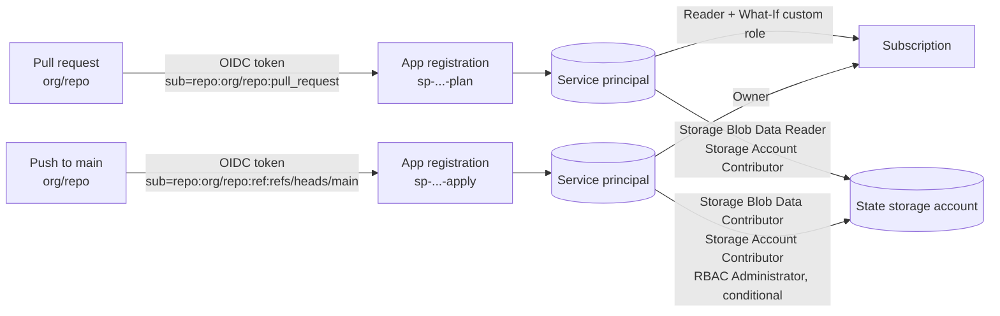

# Service Principal Setup — Plan and Apply Identities with GitHub OIDC

Scope: how to create the two Entra ID workload identities the Terraform state workflows sign in as, their GitHub OIDC federated credentials, their Azure roles and the GitHub repository variables that tie them together.

Every sample below uses `org/repo` as the GitHub owner and repository, and placeholders such as `<subscription-id>` for tenant-specific values. Substitute your own.

- Implementation of the workflows themselves: [tfstate-infrastructure.md](tfstate-infrastructure.md)
- Design rationale: [terraform-best-practices.md](terraform-best-practices.md)

---

## 1. Why two identities

`tfstate-infrastructure-plan.yml` runs on pull requests and only previews (Bicep What-if, `terraform plan -lock=false`). `tfstate-infrastructure-deploy.yml` runs on push to `main` and changes Azure. A pull request can be opened by anyone with write access and its content is not reviewed yet, so the identity it can obtain a token for must not be able to write anything.

| | Plan identity | Apply identity |
|---|---|---|
| Used by | `tfstate-infrastructure-plan.yml`, `policies-plan.yml` | `tfstate-infrastructure-deploy.yml`, `policies-deploy.yml` |
| Trigger | `pull_request` | `push` to `main` |
| Federated subject | `repo:org/repo:pull_request` | `repo:org/repo:ref:refs/heads/main` |
| Azure data plane | Read state | Read **and write** state |
| Azure control plane | Read + deployment what-if; read policy resources (EPAC plan) | Create resources, role assignments, locks; deploy policy resources (EPAC) |
| Client secret | None (OIDC) | None (OIDC) |



The Azure Policy workflows (`policies-plan.yml`, `policies-deploy.yml`, see [policies.md](policies.md)) sign in as the same two identities with the same federated credentials; Reader covers the EPAC plan and Owner covers the EPAC deploy, so nothing extra is created for them.

A federated credential replaces a client secret: GitHub issues a short-lived OIDC token for the running workflow, Entra ID checks issuer, subject and audience, and returns an access token. Nothing to store, nothing to rotate. Pull requests **from forks** get no OIDC token, so they cannot run the plan workflow at all.

---

## 2. What this setup creates

| Object | Plan | Apply | Created by |
|---|---|---|---|
| App registration + service principal | `sp-<app>-tfstate-<env>-<num>-plan` | `sp-<app>-tfstate-<env>-<num>-apply` | This setup |
| Federated credential (branch / PR) | subject `repo:org/repo:pull_request` | subject `repo:org/repo:ref:refs/heads/main` | This setup |
| Federated credential (GitHub Environment, optional) | `repo:org/repo:environment:tfstate-plan` | `repo:org/repo:environment:tfstate-apply` | This setup |
| Custom role `Terraform Plan What-If Operator` | assigned | — | This setup ([`infrastructure/rbac/terraform-plan-whatif-role.json`](../infrastructure/rbac/terraform-plan-whatif-role.json)) |
| Subscription role assignments | Reader + the custom role | Owner (or Contributor + User Access Administrator) | This setup |
| Storage account / container role assignments | Storage Blob Data Reader, Storage Account Contributor | Storage Blob Data Contributor, Storage Account Contributor, conditional RBAC Administrator | **Bicep**, from the `TERRAFORM_*_PRINCIPAL_ID` variables |
| Exclusion from the state access alert | yes | yes | **Terraform**, from the same variables |

The names follow the repository's naming scheme, derived from `infrastructure/parameterfiles/tfstate-infrastructure.json`. With the committed values (`alz`, `dev`, `1`) that is `sp-alz-tfstate-dev-1-plan` and `sp-alz-tfstate-dev-1-apply`.

The storage roles are deliberately **not** created here. `infrastructure/bicep/modules/storage.bicep` owns them so that they are reviewed in a pull request and stay in sync with the alert allow-list (see [tfstate-infrastructure.md § 7](tfstate-infrastructure.md#7-access-control-rbac)).

---

## 3. Prerequisites

To run the setup you need:

| Where | Permission |
|---|---|
| Entra ID | Application Developer (create app registrations) — or an existing app registration you may edit. Creating the service principal object may require Application Administrator or Cloud Application Administrator. |
| Subscription | Owner, or User Access Administrator + Contributor (to create role assignments and a custom role definition) |
| Tools | `az` (logged in), `jq`, and `gh` only for `--set-github-variables` |
| GitHub | Admin on `org/repo` (to set repository variables) |

Do the bootstrap with a **PIM-activated** account and let the standing assignments be the two workload identities only.

---

## 4. Quick start (script)

[`infrastructure/scripts/create-service-principals.sh`](../infrastructure/scripts/create-service-principals.sh) does everything in section 5 and is safe to re-run — each step checks first and creates only what is missing.

```bash
az login
az account set --subscription <subscription-id>

# See what it would do
infrastructure/scripts/create-service-principals.sh --repo org/repo --dry-run

# Do it
infrastructure/scripts/create-service-principals.sh --repo org/repo

# Do it and write the GitHub repository variables too (needs: gh auth login)
infrastructure/scripts/create-service-principals.sh --repo org/repo --set-github-variables
```

Useful options: `--subscription <id>`, `--apply-role Contributor+UAA`, `--default-branch <name>`, `--name-prefix <prefix>`, `--environments` (also add GitHub Environment subjects), `--owner-id` / `--repo-id` / `--no-immutable-subjects` (immutable-ID subjects, section 5.2), `--help` for the full list.

It prints the six repository variables to set. Continue with section 7.

---

## 5. Doing it by hand

Values used below:

```bash
REPO="org/repo"                                  # GitHub owner/repository
SUBSCRIPTION_ID="<subscription-id>"
PLAN_APP_NAME="sp-alz-tfstate-dev-1-plan"
APPLY_APP_NAME="sp-alz-tfstate-dev-1-apply"
ISSUER="https://token.actions.githubusercontent.com"
AUDIENCE="api://AzureADTokenExchange"

az login
az account set --subscription "$SUBSCRIPTION_ID"
TENANT_ID=$(az account show --query tenantId -o tsv)
```

### 5.1 App registrations and service principals

```bash
PLAN_APP_ID=$(az ad app create --display-name "$PLAN_APP_NAME" \
  --sign-in-audience AzureADMyOrg --query appId -o tsv)
PLAN_OBJECT_ID=$(az ad sp create --id "$PLAN_APP_ID" --query id -o tsv)

APPLY_APP_ID=$(az ad app create --display-name "$APPLY_APP_NAME" \
  --sign-in-audience AzureADMyOrg --query appId -o tsv)
APPLY_OBJECT_ID=$(az ad sp create --id "$APPLY_APP_ID" --query id -o tsv)
```

Two IDs matter and they are easy to confuse:

- **`appId`** (client ID) — goes into `AZURE_PLAN_CLIENT_ID` / `AZURE_APPLY_CLIENT_ID`, used by `azure/login`.
- **service principal `id`** (object ID) — goes into `TERRAFORM_PLAN_PRINCIPAL_ID` / `TERRAFORM_APPLY_PRINCIPAL_ID`, used by Bicep for role assignments and by the alert allow-list. It is the object ID of the *service principal*, not of the app registration.

Getting these two the wrong way round fails **silently**: `storage.bicep` passes `principalType: 'ServicePrincipal'` on its role assignments, which tells ARM to skip the directory lookup, so a role assignment for a client ID (or any other GUID that is not a service principal object ID) is created without error and grants nothing. The deploy succeeds and the next run is denied at the data plane.

Never create a client secret or certificate for these apps.

### 5.2 Federated credentials (GitHub OIDC)

```bash
az ad app federated-credential create --id "$PLAN_APP_ID" --parameters '{
  "name": "github-pull-request",
  "issuer": "https://token.actions.githubusercontent.com",
  "subject": "repo:org/repo:pull_request",
  "description": "tfstate-infrastructure-plan.yml on pull requests",
  "audiences": ["api://AzureADTokenExchange"]
}'

az ad app federated-credential create --id "$APPLY_APP_ID" --parameters '{
  "name": "github-branch-main",
  "issuer": "https://token.actions.githubusercontent.com",
  "subject": "repo:org/repo:ref:refs/heads/main",
  "description": "tfstate-infrastructure-deploy.yml on main",
  "audiences": ["api://AzureADTokenExchange"]
}'
```

The `subject` must match the claim GitHub puts in the token **exactly**, including case. Common subjects:

| Workflow trigger | Subject |
|---|---|
| Pull request | `repo:org/repo:pull_request` |
| Push to a branch | `repo:org/repo:ref:refs/heads/main` |
| Tag | `repo:org/repo:ref:refs/tags/v1.0.0` |
| GitHub Environment | `repo:org/repo:environment:tfstate-apply` |

**Immutable-ID subjects.** A repository can be configured to put GitHub's database IDs in the claim, so that the trust survives a rename of the owner or the repository:

| Shape | Subject |
|---|---|
| Plain | `repo:org/repo:ref:refs/heads/main` |
| Immutable IDs | `repo:org@<owner-id>/repo@<repo-id>:ref:refs/heads/main` |

Entra ID compares the subject as a literal string, so a credential for one shape does **not** match the other, and the failure looks like `AADSTS700213` (section 11). Register both shapes — an app registration holds up to 20 federated credentials, and having both means the repository's OIDC setting can be flipped either way without breaking the workflows. The setup script does this automatically when it can determine the IDs:

```bash
# The IDs, if you need them by hand
gh api repos/org/repo --jq '{owner_id: .owner.id, repo_id: .id}'

# They also appear verbatim in the failing run's log, in the "subject claim" line
az ad app federated-credential create --id "$APPLY_APP_ID" --parameters '{
  "name": "github-branch-main-ids",
  "issuer": "https://token.actions.githubusercontent.com",
  "subject": "repo:org@<owner-id>/repo@<repo-id>:ref:refs/heads/main",
  "description": "tfstate-infrastructure-deploy.yml on main (immutable IDs)",
  "audiences": ["api://AzureADTokenExchange"]
}'
```

Do not use wildcard subjects (`repo:org/repo:*`) — that would let any branch in the repository obtain the apply token. An app registration can hold up to 20 federated credentials, so add one per subject you actually need.

In the portal the same thing is **Entra ID → App registrations → the app → Certificates & secrets → Federated credentials → Add credential → GitHub Actions deploying Azure resources**, with entity type *Pull request* for plan and *Branch* = `main` for apply.

### 5.3 Subscription roles for the plan identity

Reader covers reading the resources What-if validates and everything `terraform plan` refreshes. It does **not** cover the What-if call itself, which needs `Microsoft.Resources/deployments/*` actions. Hence the small custom role in [`infrastructure/rbac/terraform-plan-whatif-role.json`](../infrastructure/rbac/terraform-plan-whatif-role.json):

```bash
SCOPE="/subscriptions/$SUBSCRIPTION_ID"

jq --arg scope "$SCOPE" 'del(.["//"]) | .AssignableScopes = [$scope]' \
  infrastructure/rbac/terraform-plan-whatif-role.json > /tmp/whatif-role.json
az role definition create --role-definition /tmp/whatif-role.json

az role assignment create --assignee-object-id "$PLAN_OBJECT_ID" \
  --assignee-principal-type ServicePrincipal --role "Reader" --scope "$SCOPE"
az role assignment create --assignee-object-id "$PLAN_OBJECT_ID" \
  --assignee-principal-type ServicePrincipal --role "Terraform Plan What-If Operator" --scope "$SCOPE"
```

Role definition names are unique per tenant; if the name is taken, pick another and adjust both the JSON and the assignment. A new role definition takes a minute or so to become assignable.

### 5.4 Subscription roles for the apply identity

The deploy workflow creates a resource group, role assignments and a `CanNotDelete` lock, so it needs more than Contributor:

```bash
az role assignment create --assignee-object-id "$APPLY_OBJECT_ID" \
  --assignee-principal-type ServicePrincipal --role "Owner" --scope "$SCOPE"
```

If standing Owner is not acceptable, use the narrower pair instead — User Access Administrator covers `Microsoft.Authorization/*`, which is what role assignments and the lock need:

```bash
az role assignment create --assignee-object-id "$APPLY_OBJECT_ID" \
  --assignee-principal-type ServicePrincipal --role "Contributor" --scope "$SCOPE"
az role assignment create --assignee-object-id "$APPLY_OBJECT_ID" \
  --assignee-principal-type ServicePrincipal --role "User Access Administrator" --scope "$SCOPE"
```

Scope both to the subscription: the deploy creates the resource group, so a resource-group scope would not exist on the first run.

---

## 6. Roles on the state storage account (created by Bicep)

Once the repository variables are set, the deploy workflow passes the object IDs to Bicep, which creates these. Nothing to do by hand:

| Principal | Role | Scope | Why |
|---|---|---|---|
| Plan | Storage Blob Data Reader | each state container | read state for `terraform plan -lock=false` |
| Plan | Storage Account Contributor | storage account | add/remove the runner IP in the firewall (control plane only) |
| Apply | Storage Blob Data Contributor | each state container | read/write state and take the blob lease lock |
| Apply | Storage Account Contributor | storage account | same firewall rule |
| Apply | Role Based Access Control Administrator, **ABAC-conditioned** | storage account | let Terraform assign only Storage Account Backup Contributor to the backup vault identity |

Shared keys are disabled on the account, so all data access goes through Entra ID. See [tfstate-infrastructure.md § 7](tfstate-infrastructure.md#7-access-control-rbac).

---

## 7. GitHub configuration

**Settings → Secrets and variables → Actions → Variables.** None of these are secrets; client and object IDs are not credentials.

| Variable | Value | Used by |
|---|---|---|
| `AZURE_TENANT_ID` | tenant ID | all workflows |
| `AZURE_SUBSCRIPTION_ID` | subscription ID | all workflows |
| `AZURE_PLAN_CLIENT_ID` | plan app registration `appId` | plan workflows login |
| `AZURE_APPLY_CLIENT_ID` | apply app registration `appId` | deploy workflows login |
| `TERRAFORM_PLAN_PRINCIPAL_ID` | plan service principal object ID | Bicep role assignments, alert allow-list |
| `TERRAFORM_APPLY_PRINCIPAL_ID` | apply service principal object ID | Bicep role assignments, alert allow-list |

```bash
gh variable set AZURE_TENANT_ID              --repo org/repo --body "$TENANT_ID"
gh variable set AZURE_SUBSCRIPTION_ID        --repo org/repo --body "$SUBSCRIPTION_ID"
gh variable set AZURE_PLAN_CLIENT_ID         --repo org/repo --body "$PLAN_APP_ID"
gh variable set AZURE_APPLY_CLIENT_ID        --repo org/repo --body "$APPLY_APP_ID"
gh variable set TERRAFORM_PLAN_PRINCIPAL_ID  --repo org/repo --body "$PLAN_OBJECT_ID"
gh variable set TERRAFORM_APPLY_PRINCIPAL_ID --repo org/repo --body "$APPLY_OBJECT_ID"
```

All workflows fall back to a single `AZURE_CLIENT_ID` when the per-identity variable is absent:

```yaml
# .github/workflows/tfstate-infrastructure-plan.yml
client-id: ${{ vars.AZURE_PLAN_CLIENT_ID || vars.AZURE_CLIENT_ID }}
# .github/workflows/tfstate-infrastructure-deploy.yml
client-id: ${{ vars.AZURE_APPLY_CLIENT_ID || vars.AZURE_CLIENT_ID }}
```

So an existing single-identity setup keeps working, and setting the two new variables is what splits it. Remove `AZURE_CLIENT_ID` once both are in place, so nothing silently falls back.

Also set `TERRAFORM_STATE_ALLOWED_IPS` and the `*_LOCAL_*` variables if you use them — see [tfstate-infrastructure.md § 5](tfstate-infrastructure.md#5-configuration).

### Optional: GitHub Environments and an approval gate

To require a human approval before an apply, put the deploy job in a protected environment:

```yaml
jobs:
  tfstate-infrastructure-deploy:
    runs-on: ubuntu-latest
    environment: tfstate-apply       # Settings -> Environments -> required reviewers
```

Then the OIDC subject changes to `repo:org/repo:environment:tfstate-apply`, so add that federated credential to the apply app (`--environments` in the script does this) — GitHub still emits the branch subject only when the job has no `environment:`. Environment-scoped variables override repository variables, which is the other way to keep the two client IDs apart. Protected environments on private repositories require a paid GitHub plan.

---

## 8. Order of operations

The storage roles come from the deploy itself, so the identities only have their subscription-scope roles until the deploy workflow has run once:

1. Create both identities, their federated credentials and the subscription roles (sections 4–5).
2. Set the repository variables (section 7).
3. Merge a change under `infrastructure/` to `main`. The deploy workflow runs `Bicep deploy` **before** its Terraform steps, so one run does everything: Bicep creates the resource group, storage account, containers, **the storage role assignments for both principals** and the lock, and Terraform then imports them and creates the monitoring, alert and backup resources.
4. Open a pull request touching `infrastructure/` to confirm the plan identity works end to end.

Between steps 1 and 3 neither workflow can reach the state container — there is no blob role yet, and on a first deployment no storage account either. That is expected.

This ordering is deliberate: it is what lets a newly introduced identity bootstrap itself, including when the storage account already exists. If Bicep deployed *after* the Terraform steps, the firewall step's blob probe would fail (`Blob access still denied after …`) before the run reached the step that grants the role. See the comment above `Bicep deploy` in `.github/workflows/tfstate-infrastructure-deploy.yml`.

**Granting the storage roles without a deploy.** Only needed when you cannot run the deploy workflow — for example to unblock a run on an older workflow version, or to use the state from your own machine:

```bash
SA=st<app><env><num><uid>; RG=rg-<app>-tfstate-<env>-<num>
ACCOUNT_ID=$(az storage account show -n "$SA" -g "$RG" --query id -o tsv)

az role assignment create --assignee-object-id "$APPLY_OBJECT_ID" --assignee-principal-type ServicePrincipal \
  --role "Storage Blob Data Contributor" --scope "$ACCOUNT_ID/blobServices/default/containers/tfstate"
az role assignment create --assignee-object-id "$PLAN_OBJECT_ID" --assignee-principal-type ServicePrincipal \
  --role "Storage Blob Data Reader" --scope "$ACCOUNT_ID/blobServices/default/containers/tfstate"
az role assignment create --assignee-object-id "$APPLY_OBJECT_ID" --assignee-principal-type ServicePrincipal \
  --role "Storage Account Contributor" --scope "$ACCOUNT_ID"
az role assignment create --assignee-object-id "$PLAN_OBJECT_ID" --assignee-principal-type ServicePrincipal \
  --role "Storage Account Contributor" --scope "$ACCOUNT_ID"
```

The next deploy creates the same assignments from Bicep, with the same deterministic GUID names, so these are adopted rather than duplicated.

RBAC changes take a few minutes to propagate. An authorization error on the first run right after a role change is normally fixed by re-running the workflow.

---

## 9. Verification

```bash
# Federated credentials, per app
az ad app federated-credential list --id "$PLAN_APP_ID"  --query "[].{name:name, subject:subject}" -o table
az ad app federated-credential list --id "$APPLY_APP_ID" --query "[].{name:name, subject:subject}" -o table

# No secrets or certificates should exist on either app
az ad app show --id "$PLAN_APP_ID"  --query "{secrets: passwordCredentials, certs: keyCredentials}"
az ad app show --id "$APPLY_APP_ID" --query "{secrets: passwordCredentials, certs: keyCredentials}"

# Role assignments, including the ones Bicep made on the storage account
az role assignment list --assignee "$PLAN_OBJECT_ID"  --all -o table
az role assignment list --assignee "$APPLY_OBJECT_ID" --all -o table

# The variables GitHub will use
gh variable list --repo org/repo
```

The plan identity's list should contain no `*Contributor` role on the containers, and no role at all that allows writing blobs.

---

## 10. Maintenance

| Task | Cadence | Note |
|---|---|---|
| Access review of both service principals | 90 days | Entra ID Access Reviews; the assignments are standing |
| Check no client secret was added | with the review | `az ad app show ... --query passwordCredentials` |
| Re-check federated subjects after a branch rename | on change | Renaming the default branch breaks `ref:refs/heads/main`; add the new subject before renaming |
| Re-check after moving the repository | on change | The plain subject contains `org/repo`, so a transfer or rename invalidates it. The immutable-ID subject (section 5.2) survives both. |
| Re-check after changing the repository's OIDC subject setting | on change | Switching between the plain and immutable-ID shape changes every subject; keep both registered |
| Remove identities for retired environments | on decommission | Delete the app registration; the role assignments go with the service principal |

There are no credentials to rotate — that is the point of federation.

---

## 11. Troubleshooting

| Symptom | Cause | Fix |
|---|---|---|
| `AADSTS700213: No matching federated identity record found for presented assertion subject 'repo:org@<owner-id>/repo@<repo-id>:...'` | The repository issues immutable-ID subjects; the credential has the plain shape | Add a credential for the exact subject from the log, section 5.2 |
| `AADSTS70021 / AADSTS700213: No matching federated identity record found` in general | The subject in the token differs from the credential | Copy the `subject claim` line from the run log and compare it character by character. Adding `environment:` to a job changes the subject too. |
| `AADSTS700016: Application with identifier ... was not found` | Wrong client ID, or the app is in another tenant | Check `AZURE_PLAN_CLIENT_ID` / `AZURE_APPLY_CLIENT_ID` and `AZURE_TENANT_ID` |
| `Unable to get ACTIONS_ID_TOKEN_REQUEST_URL` | The workflow lacks `permissions: id-token: write` | Both workflows already set it; check a workflow you added |
| Plan workflow fails at Bicep What-if with `AuthorizationFailed` on `Microsoft.Resources/deployments/whatIf/action` | The custom role is missing or not assigned | Section 5.3. If it still fails, widen the role's `Actions` to `Microsoft.Resources/deployments/*`. |
| `Blob access still denied after <n>s` from the firewall step, after it added the rule | The firewall rule went in (control plane), so the signed-in principal is missing a **Storage Blob Data** role. Owner, Contributor and Storage Account Contributor do not grant blob data access. | The step prints a Diagnostics group with the signed-in identity, its object ID, the firewall rules and the role assignments. Check that object ID equals `TERRAFORM_APPLY_PRINCIPAL_ID` (deploy) or `TERRAFORM_PLAN_PRINCIPAL_ID` (plan), then re-run the deploy so Bicep assigns the role. |
| Role assignment exists in the portal but grants nothing | The variable holds the `appId` instead of the service principal object ID; `principalType` made ARM accept it (section 5.1) | Fix the variable to the object ID, delete the stale assignment, re-run the deploy |
| `403 AuthorizationFailure` from `terraform init`, after the firewall probe passed | Not RBAC — that reads `AuthorizationPermissionMismatch`. This is the storage firewall: the rule was lost to a concurrent rule rewrite, or the job's egress IP is not the one that was allowed | Re-run the workflow. The Terraform step's diagnostics group shows the current rules and the runner's IP. Confirm in `StorageBlobLogs` by the request ID from the error. |
| `AuthorizationPermissionMismatch` listing blobs in the plan job | No Storage Blob Data Reader yet, or `TERRAFORM_PLAN_PRINCIPAL_ID` is unset/wrong | Section 8: the roles appear after the first successful deploy. Verify the value is the **service principal object ID**. |
| Deploy fails creating a role assignment or the lock | Apply identity only has Contributor | Add User Access Administrator, or use Owner |
| Every run raises the state access alert | The workflow identity is not the principal in the variables | The `appId` used for login and the object ID in `TERRAFORM_*_PRINCIPAL_ID` must belong to the same service principal |
| Pull requests from forks never run the plan | GitHub issues no OIDC token to fork PRs | Intended. Run the plan from a branch in the repository. |
| `Insufficient privileges to complete the operation` while creating the app | The account lacks Application Developer | Have an Entra ID admin create the app registrations, then run the rest |

---

## References

- [tfstate-infrastructure.md](tfstate-infrastructure.md): the workflows and infrastructure these identities drive
- [terraform-best-practices.md](terraform-best-practices.md): why plan and apply are separated
- [Configure a federated identity credential on an app](https://learn.microsoft.com/entra/workload-id/workload-identity-federation-create-trust)
- [GitHub OIDC: about security hardening with OpenID Connect](https://docs.github.com/actions/deployment/security-hardening-your-deployments/about-security-hardening-with-openid-connect)
- [GitHub OIDC subject claims for Azure](https://docs.github.com/actions/deployment/security-hardening-your-deployments/configuring-openid-connect-in-azure)
- [Azure custom roles](https://learn.microsoft.com/azure/role-based-access-control/custom-roles)
- [Bicep What-if validation levels](https://learn.microsoft.com/azure/azure-resource-manager/templates/deploy-what-if)
