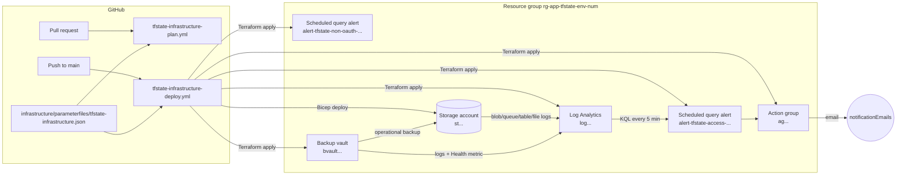

# Terraform State Infrastructure — How It Works

Scope: what is in this repository today, how the pieces fit together, and how to run and change them. It covers the GitHub Actions workflows, the Bicep and Terraform code under `infrastructure/`, the Checkov policy scan, monitoring, alerting, backup and the local tooling.

For the reasoning behind the design (why the state account is bootstrapped outside Terraform, which settings are non-negotiable, and so on), see [terraform-best-practices.md](terraform-best-practices.md). This document describes the implementation of that guidance. For creating the two workload identities the workflows sign in as, see [service-principal-setup.md](service-principal-setup.md). For the Azure Policy layer that locks the subscription down to these resources, see [policies.md](policies.md).

---

## 1. Overview

The repository creates and operates the Azure Storage Account that holds Terraform remote state, plus the monitoring and backup around it. It uses two tools on purpose:

- **Bicep** creates the resource group, the storage account, its containers, the role assignments and the delete lock. This is "Option B" in the best-practices doc: the backend exists before, and independently of, any Terraform run, so `terraform destroy` can never remove its own backend.
- **Terraform** adopts the Bicep resources through `import` blocks (with `prevent_destroy`) and adds everything that is not needed to bootstrap state: diagnostic settings, the Log Analytics workspace, the action group, the state access alert and the backup vault.



---

## 2. Repository layout

| Path | Purpose |
|---|---|
| `.github/workflows/tfstate-infrastructure-plan.yml` | Pull request workflow: Checkov, Bicep What-if, Terraform plan. Changes nothing in Azure except a temporary firewall rule. |
| `.github/workflows/tfstate-infrastructure-deploy.yml` | Push-to-main workflow: Checkov, Bicep What-if, Terraform plan, Bicep deploy, Terraform apply. |
| `.github/workflows/policies-plan.yml` | Pull request workflow for `policies/`: validates the EPAC files and builds the Azure Policy deployment plan. Changes nothing in Azure. |
| `.github/workflows/policies-deploy.yml` | Push-to-main workflow for `policies/`: builds a fresh plan and deploys the policy definitions, sets and assignments. |
| `.github/workflows/act-hello-world-test.yml` | Manual smoke test that `act` and GitHub Actions can run workflows in this repo. |
| `.github/actions/checkov-scan/` | Composite action that installs a pinned Checkov and scans `infrastructure/`. |
| `.github/actions/storage-firewall-runner-ip/` | Composite action that adds or removes the runner's public IP on the storage account firewall. |
| `.github/actions/epac-setup/` | Composite action that installs pinned EPAC and Az PowerShell modules. |
| `.github/actions/epac-definitions/` | Composite action that renders the tenant and subscription placeholders in `policies/` and validates the files. |
| `.github/dependabot.yml` | Weekly grouped updates for the SHA-pinned GitHub Actions. |
| `infrastructure/parameterfiles/tfstate-infrastructure.json` | Input values for both workflows. |
| `infrastructure/rbac/terraform-plan-whatif-role.json` | Custom role definition the plan identity needs for Bicep What-if ([service-principal-setup.md](service-principal-setup.md)). |
| `infrastructure/scripts/create-service-principals.sh` | Creates the plan and apply identities, their GitHub OIDC federated credentials and subscription roles. |
| `infrastructure/bicep/main.bicep` | Subscription-scope entry point: resource group + `storage` module. |
| `infrastructure/bicep/modules/storage.bicep` | Storage account, blob service, containers, role assignments, delete lock. |
| `infrastructure/terraform/` | Root module: resource group (imported), module wiring, imports, variables, outputs. |
| `infrastructure/terraform/modules/storage/` | Storage account and containers (imported from Bicep), diagnostic settings. |
| `infrastructure/terraform/modules/log-analytics/` | Log Analytics workspace. |
| `infrastructure/terraform/modules/action-group/` | Action group with one email receiver per address. |
| `infrastructure/terraform/modules/scheduled-query-alert/` | Generic log search alert rule (v2). |
| `infrastructure/terraform/modules/backup-vault/` | Backup vault, policy, backup instance, role assignment, diagnostics. |
| `infrastructure/terraform/queries/tfstate-unexpected-access.kql.tftpl` | KQL template for the state access alert. |
| `infrastructure/terraform/backend.tfbackend.example`, `terraform.tfvars.example` | Examples for running Terraform by hand. |
| `policies/` | Enterprise Policy as Code (EPAC): the allow-list policy that denies every resource type `infrastructure/` does not use, the deny-by-default hardening policies for the allowed types, and their assignments ([policies.md](policies.md)). |
| `.devcontainer/` | Dev container for Claude Code with Terraform and an egress firewall ([README](../.devcontainer/README.md)). |
| `docs/` | This document, the service principal setup guide, the Azure Policy guide ([policies.md](policies.md)) and the best-practices guide. |

---

## 3. What each tool owns

| Resource | Created by | Managed afterwards by | `managedBy` tag |
|---|---|---|---|
| Resource group `rg-<app>-tfstate-<env>-<num>` | Bicep | Bicep + Terraform (imported, `prevent_destroy`) | `bicep` |
| Storage account `st<suffix>` | Bicep | Bicep + Terraform (imported, `prevent_destroy`) | `bicep` |
| Blob containers (default `tfstate`) | Bicep | Bicep + Terraform (imported, `prevent_destroy`) | — |
| Storage firewall IP rules | Bicep (`allowedIpAddresses`) | Bicep; pipelines add/remove the runner IP temporarily. Terraform ignores them (`ignore_changes`). | — |
| Role assignments on containers and account | Bicep | Bicep only | — |
| `CanNotDelete` lock on the resource group | Bicep | Bicep only | — |
| Diagnostic settings (blob, queue, table, file) | Terraform | Terraform | — |
| Log Analytics workspace `log<suffix>` | Terraform | Terraform | `terraform` |
| Action group `ag<suffix>` | Terraform | Terraform | `terraform` |
| Alert rule `alert-tfstate-access-<suffix>` | Terraform | Terraform | `terraform` |
| Alert rule `alert-tfstate-non-oauth-<suffix>` | Terraform | Terraform | `terraform` |
| Backup vault `bvault<suffix>`, policy, instance, vault role assignment, vault diagnostics | Terraform | Terraform | `terraform` |

Both tools write the same storage settings (TLS, versioning, soft delete, point-in-time restore and so on). Terraform's tags and settings are kept identical to Bicep's, so the first plan after import shows no changes and the two never overwrite each other. **When you change a storage setting, change it in both `modules/storage.bicep` and `terraform/modules/storage/main.tf`.**

`imports.tf` adopts the resource group, storage account and containers. After the first successful apply the blocks are no-ops and can be removed.

---

## 4. Naming

All names derive from four inputs, lower-cased: `location`, `applicationName` (1–5 chars), `environmentName` (1–3 chars) and `environmentNumber` (1–9).

The workflows compute a deterministic 13-character `uniqueIdentifier`:

```bash
printf '%s|%s|%s|%s' "$LOCATION" "$APPLICATION_NAME" "$ENVIRONMENT_NAME" "$ENVIRONMENT_NUMBER" | sha256sum | cut -c1-13
```

The same inputs always produce the same storage account name, so re-running a workflow never creates a second account.

`suffix = <app><env><num><uniqueIdentifier>`

| Resource | Pattern | Example (`westeurope`, `alz`, `dev`, `1`) |
|---|---|---|
| Resource group | `rg-<app>-tfstate-<env>-<num>` | `rg-alz-tfstate-dev-1` |
| Storage account (max 24) | `st<suffix>` | `stalzdev1id` |
| Log Analytics workspace | `log<suffix>` | `logalzdev1id` |
| Action group | `ag<suffix>` | `agalzdev1id` |
| Action group short name (max 12) | `ag<app><env><num>` | `agalzdev1` |
| State access alert | `alert-tfstate-access-<suffix>` | `alert-tfstate-access-alzdev1id` |
| Non-OAuth access alert | `alert-tfstate-non-oauth-<suffix>` | `alert-tfstate-non-oauth-alzdev1id` |
| Backup vault | `bvault<suffix>` | `bvaultalzdev1id` |
| Backup policy / instance | fixed | `bkpol-tfstate-blob` / `terraform-state-backup-instance` |
| Azure deployment (Bicep) | `tfstate-infrastructure-<app>-<env>-<num>` | `tfstate-infrastructure-alz-dev-1` |
| Terraform state key | `tfstate-infrastructure/<env>-<num>.tfstate` | `tfstate-infrastructure/dev-1.tfstate` |

The Terraform state key and the Azure deployment name deliberately do not contain the workflow file names. Renaming a workflow must never point Terraform at a new, empty state file.

---

## 5. Configuration

### Parameter file

`infrastructure/parameterfiles/tfstate-infrastructure.json` holds the input values. Both workflows read it in the **jq read parameter file** step.

```json
{
  "location": "westeurope",
  "applicationName": "alz",
  "environmentName": "dev",
  "environmentNumber": 1,
  "networkDefaultAction": "Allow",
  "notificationEmails": ["platform-team@example.com"]
}
```

| Key | Used by | Validation |
|---|---|---|
| `location` | Bicep, Terraform, naming | Letters and digits only (workflow) |
| `applicationName` | Bicep, Terraform, naming | Letters and digits only (workflow); 1–5 chars (Bicep, Terraform) |
| `environmentName` | Bicep, Terraform, naming | Letters and digits only (workflow); 1–3 chars (Bicep, Terraform) |
| `environmentNumber` | Bicep, Terraform, naming | Single digit 1–9 (workflow) |
| `networkDefaultAction` | Bicep (`networkDefaultAction`), Terraform (`network_default_action`) → storage firewall | `Allow` or `Deny` (workflow, Bicep, Terraform). Optional; defaults to `Deny`. See [State storage network access](#state-storage-network-access). |
| `notificationEmails` | Terraform (`notification_emails`) → action group | Must be an array of strings (workflow); each must look like an email address (Terraform) |

All keys except `networkDefaultAction` are required; a missing key fails the run before any Azure call.

### Repository variables

Set these under **Settings → Secrets and variables → Actions → Variables**. None of them are secrets.

| Variable | Required | Effect |
|---|---|---|
| `AZURE_PLAN_CLIENT_ID` | Yes (GitHub) | App registration the **plan** workflow signs in as. Falls back to `AZURE_CLIENT_ID`. |
| `AZURE_APPLY_CLIENT_ID` | Yes (GitHub) | App registration the **deploy** workflow signs in as. Falls back to `AZURE_CLIENT_ID`. |
| `AZURE_CLIENT_ID` | Only as fallback | Single app registration for both workflows, used when the two above are unset |
| `AZURE_TENANT_ID` | Yes (GitHub) | Tenant for OIDC login |
| `AZURE_SUBSCRIPTION_ID` | Yes (GitHub), optional in `act` | Target subscription |
| `TERRAFORM_APPLY_PRINCIPAL_ID` | No | Object ID of the apply identity. Gets data and RBAC roles (section 7) and is excluded from the state access alert. |
| `TERRAFORM_PLAN_PRINCIPAL_ID` | No | Object ID of the plan identity. Gets read roles (section 7) and is excluded from the state access alert. |
| `TERRAFORM_LOCAL_PRINCIPAL_ID` | No | Object ID of a user for local `act` runs. Gets Blob Data Contributor. **Not** excluded from the alert. |
| `TERRAFORM_STATE_ALLOWED_IPS` | No | Comma-separated static IPs/CIDRs always allowed through the storage firewall |
| `TERRAFORM_STATE_LOCAL_ALLOWED_IPS` | No | Extra IPs added only when running under `act` (for example your own public IP, no `/32`) |

Both workflows pass the same Bicep parameters. That way the plan workflow's What-if previews exactly what the deploy workflow will do. See the note on `APPLY_PRINCIPAL_ID` in section 6.

How to create the identities behind these values: [service-principal-setup.md](service-principal-setup.md).

### Terraform variables with defaults

These are not in the parameter file; override them in `variables.tf` or with `-var` if needed: `container_names` (`["tfstate"]`), `replication_type` (`GZRS`), `soft_delete_retention_days` (90), `restore_policy_days` (30), `public_network_access_enabled` (true), `log_analytics_sku` (`PerGB2018`), `log_analytics_retention_in_days` (30, allowed 30–730), `backup_vault_datastore_type` (`VaultStore`), `backup_vault_redundancy` (`LocallyRedundant`).

---

## 6. Workflows

### Triggers and concurrency

| Workflow | Trigger | Concurrency group | Cancel in progress |
|---|---|---|---|
| `tfstate-infrastructure-plan.yml` | `pull_request` with changes under `infrastructure/**` | `tfstate-infrastructure-plan-<PR number>` | Yes: a new push to the PR cancels its running plan |
| `tfstate-infrastructure-deploy.yml` | `push` to `main` with changes under `infrastructure/**` | `tfstate-infrastructure-deploy` | No: deploys run one at a time and are never dropped |

The two workflows use **separate** concurrency groups. GitHub cancels a *pending* run when a newer run joins the same group, so a shared group would let a queued PR plan silently drop a queued deploy. The trade-off is that a plan and a deploy can edit the storage firewall at the same moment (section 6, "Storage firewall handling").

Changes outside `infrastructure/` do not trigger either workflow. That includes changes to the workflows themselves and to the composite actions.

### Plan workflow steps

| # | Step | Notes |
|---|---|---|
| 1 | Checkout | |
| 2 | Install Azure CLI and jq | `act` only |
| 3 | **Checkov scan** | Before any Azure login, so policy findings fail the PR without touching Azure |
| 4 | jq read parameter file | Validates keys and exports `INPUT_*` and `NOTIFICATION_EMAILS` |
| 5 | Azure login (GitHub OIDC) / Azure login (local host az login) | One or the other, depending on `ACT` |
| 6 | Azure CLI select subscription | Exports `ARM_SUBSCRIPTION_ID` for the azurerm provider and backend |
| 7 | Bicep build and lint | |
| 8 | Bicep prepare deployment parameters | Validates inputs, computes `uniqueIdentifier`, writes the ARM parameters file |
| 9 | **Bicep What-if** | `az deployment sub what-if --validation-level ProviderNoRbac`: full validation, but only read permissions are checked. The deploy workflow keeps the default level (`Provider`), which also checks that the deploy identity can write everything. |
| 10 | Terraform setup | `terraform_wrapper: false` |
| 11 | Azure CLI check state storage account exists | If not (first run), the Terraform steps are skipped with a notice |
| 12 | Azure CLI allow runner IP through storage firewall | Only when `networkDefaultAction` is `Deny`. Waits until blob access actually works. |
| 13 | **Terraform plan** | `init` with backend config on the command line, then `plan -lock=false` |
| 14 | Azure CLI remove runner IP from storage firewall | `always()`, runs even when earlier steps fail or the run is cancelled |

### Deploy workflow steps

Steps 1–9 are the same as the plan workflow (the What-if here keeps the default validation level). Then:

| # | Step | Notes |
|---|---|---|
| 10 | **Bicep deploy** | `az deployment sub create`. Runs **before** every Terraform step — see below. |
| 11 | Terraform setup | `terraform_wrapper: false` |
| 12 | Azure CLI allow runner IP through storage firewall | Only when `networkDefaultAction` is `Deny`. After the Bicep deploy, which resets the rules. `timeout-seconds: 300`, because a role assignment the deploy just created needs time to propagate. |
| 13 | **Terraform plan** | Same as the plan workflow, but saved with `-out="$RUNNER_TEMP/tfstate.tfplan"` |
| 14 | **Terraform apply** | Applies exactly the saved plan |
| 15 | Azure CLI remove runner IP from storage firewall | `always()`, runs even when earlier steps fail or the run is cancelled |

Every run of the deploy workflow deploys. There is no manual trigger or preview mode; open a pull request to preview.

**Why Bicep deploys first.** The Bicep deployment is control plane only: it needs no firewall rule and no blob data role. It is also what creates the state containers and the Storage Blob Data role assignments that the Terraform steps need. With the deploy placed after them, a newly introduced workflow identity could never bootstrap itself — the firewall step's blob probe would fail before the run ever reached the step that grants the role ([service-principal-setup.md § 8](service-principal-setup.md#8-order-of-operations)).

Two things follow from the order. The saved plan is made *after* the Bicep deploy, so it is not stale and the apply cannot miss a change Bicep just made. And a Terraform plan failure no longer stops the Bicep deploy: What-if (step 9) and the pull request plan workflow are the gates for that instead.

**First run.** Bicep creates the resource group, storage account and containers, and Terraform then imports them and creates the rest — all in the same run. Only one push to `main` is needed.

### Why the plan workflow passes principal IDs to Bicep

`APPLY_PRINCIPAL_ID`, `PLAN_PRINCIPAL_ID`, `LOCAL_PRINCIPAL_ID` and `ALLOWED_IPS` become Bicep parameters that decide whether role assignments and firewall rules exist. If the plan workflow left them out, What-if would stop showing those role assignments and rules. The PR would then look clean while the merge adds or changes them.

The Terraform plan step also receives `TERRAFORM_APPLY_PRINCIPAL_ID` and `TERRAFORM_PLAN_PRINCIPAL_ID`, for the alert allow-list. `TERRAFORM_LOCAL_PRINCIPAL_ID` is deliberately not passed.

### State storage network access

`networkDefaultAction` in the parameter file sets `networkAcls.defaultAction` on the state account, in both Bicep and Terraform. It is currently **`Allow`**.

`Deny` plus a per-run IP rule was the original design, and it does not work against GitHub-hosted runners:

- GitHub publishes roughly 7000 egress ranges for hosted runners (`https://api.github.com/meta`, `actions`), and Azure Storage accepts at most 200 IP rules — the pool cannot be allowlisted.
- The per-run rule the workflows add is therefore the only option, and it is not reliable either: the address a job egresses from is not stable for every connection. In practice the firewall probe and `terraform init` succeeded while a later request from the same job was rejected with `403 AuthorizationFailure`, with the correct IP rule in place.

With `Allow`, the controls on the state account are:

| Control | Still in force |
|---|---|
| Shared key access | Disabled (`allowSharedKeyAccess: false`), so every request must present an Entra ID token |
| Authorization | Azure RBAC, scoped per container: Blob Data Reader for plan, Blob Data Contributor for apply (section 7) |
| Audit | All blob logs to Log Analytics (section 9) |
| Detection | The state access alert fires on any request by a principal outside the approved list (section 9) |
| Deletion | `CanNotDelete` lock, soft delete, versioning, point-in-time restore, operational backup (section 10) |

What is lost is the network boundary: any host on the internet can *reach* the endpoint, and is then rejected by Entra ID unless it holds a token for an approved principal.

Set `networkDefaultAction` back to `Deny` as soon as CI has a stable egress — a self-hosted or ARC runner, GitHub larger runners with a static IP range, or Azure private networking for hosted runners — and put that address in `TERRAFORM_STATE_ALLOWED_IPS`. The private endpoint described in [terraform-best-practices.md](terraform-best-practices.md) remains the target state. When `networkDefaultAction` is `Deny`, the firewall steps below run as before; when it is `Allow`, both workflows skip them.

### Storage firewall handling

These steps run only when `networkDefaultAction` is `Deny`.

The storage account denies public traffic in that mode (`defaultAction: Deny`) and GitHub-hosted runners have changing IPs. Every job that talks to the blob data plane therefore uses `.github/actions/storage-firewall-runner-ip`:

- **`mode: add`** looks up the runner's public IPv4 (ipify, falling back to ifconfig.me) and adds a rule unless it already exists. It sets `added=true` only when it created the rule. With `container-name` set, it polls `az storage blob list --auth-mode login` every 10 s (default timeout 120 s; the deploy workflow allows 300 s) until access works, so firewall propagation and missing data roles both fail clearly. On timeout it prints a diagnostics group — the real `az` error, the signed-in principal and its object ID, the account's IP rules and the role assignments on the account and container — because adding the rule succeeds with a control-plane role while the probe still needs a Storage Blob Data role.
- **`mode: remove`** removes the given IP.
- Callers remove the rule in an `always()` step, and only when `added == 'true'`, so a rule that was already there (such as an IP from `TERRAFORM_STATE_ALLOWED_IPS`) is never removed.

Rule updates are read-modify-write. Two jobs editing the rules at the same moment (for example a PR plan and a deploy) can lose one change; the affected job then fails its access check and a re-run fixes it.

### Identity used by the workflows

Each workflow signs in with its own identity: the plan workflow as `AZURE_PLAN_CLIENT_ID`, the deploy workflow as `AZURE_APPLY_CLIENT_ID`. Both fall back to `AZURE_CLIENT_ID` when their variable is unset, so a single-identity setup keeps working. That identity runs the firewall updates, the Bicep deployment and Terraform. Setting them up: [service-principal-setup.md](service-principal-setup.md).

| Need | Plan workflow | Deploy workflow |
|---|---|---|
| Repository variable | `AZURE_PLAN_CLIENT_ID` | `AZURE_APPLY_CLIENT_ID` |
| Federated credential subject | `repo:<owner>/<repo>:pull_request` | `repo:<owner>/<repo>:ref:refs/heads/main` |
| Subscription | Reader, plus `Microsoft.Resources/deployments/*` (for example through a custom role). What-if runs with `--validation-level ProviderNoRbac`, so ARM only checks read permission on the resources; the What-if call itself still needs the deployments permission, which Reader lacks. | Owner, or Contributor + User Access Administrator (resource group, role assignments, lock) |
| Storage account | Storage Account Contributor (firewall) | same |
| State containers | Storage Blob Data Reader (plan) | Storage Blob Data Contributor (apply writes state) |

Pull requests from forks get no OIDC token and cannot run the plan workflow.

In practice each workflow identity must be the one whose object ID is in `TERRAFORM_PLAN_PRINCIPAL_ID` / `TERRAFORM_APPLY_PRINCIPAL_ID` respectively. If it is not, it gets no roles from Bicep, and every run triggers the state access alert.

### Running locally with act

The workflows detect `act` through the `ACT` environment variable. Instead of OIDC they reuse the host's `az login`:

```bash
az login   # on the host

# Preview (pull_request event)
act pull_request -W .github/workflows/tfstate-infrastructure-plan.yml \
  --container-options "-v $HOME/.azure:/tmp/azure-host:ro"

# Deploys for real (push event)
act push -W .github/workflows/tfstate-infrastructure-deploy.yml \
  --container-options "-v $HOME/.azure:/tmp/azure-host:ro"
```

- **Token cache copy:** the host `~/.azure` is mounted read-only and copied to `$RUNNER_TEMP/azure`, so token refreshes never touch the host. `bin/` is removed from the copy, because a macOS Bicep binary cannot run in the Linux container.
- **Encrypted token cache:** the container can only read a plaintext cache (`msal_token_cache.json`). If the host encrypts it (macOS Keychain, Windows DPAPI), run once on the host: `az config set core.encrypt_token_cache=false && az logout && az login`.
- **Optional variables:** `--var AZURE_SUBSCRIPTION_ID=<id>`, `--var TERRAFORM_LOCAL_PRINCIPAL_ID=$(az ad signed-in-user show --query id -o tsv)`, `--var TERRAFORM_STATE_LOCAL_ALLOWED_IPS=<your public ip>`.
- **Missing tools:** act images lack the Azure CLI, jq and sometimes Python; the workflows and the Checkov action install them.

`act -W .github/workflows/act-hello-world-test.yml` runs a minimal smoke test.

---

## 7. Access control (RBAC)

Role assignments are created by `infrastructure/bicep/modules/storage.bicep`. Each is created only when its principal ID parameter is non-empty.

| Principal | Role | Scope | Why |
|---|---|---|---|
| Apply (`TERRAFORM_APPLY_PRINCIPAL_ID`) | Storage Blob Data Contributor | Each state container | Read/write state and take the blob lease lock |
| Apply | Storage Account Contributor | Storage account | Add/remove the runner IP in the firewall (control plane, no data access) |
| Apply | Role Based Access Control Administrator, **conditional** | Storage account | Let Terraform create/remove the backup vault's role assignment |
| Plan (`TERRAFORM_PLAN_PRINCIPAL_ID`) | Storage Blob Data Reader | Each state container | Read state for `terraform plan -lock=false` |
| Plan | Storage Account Contributor | Storage account | Firewall rule for the plan job |
| Local (`TERRAFORM_LOCAL_PRINCIPAL_ID`, type `User`) | Storage Blob Data Contributor | Each state container | Local `act` plan and apply |
| Backup vault managed identity | Storage Account Backup Contributor | Storage account | Operational backup; assigned by Terraform (`modules/backup-vault`) |

The RBAC Administrator assignment carries an ABAC condition (version 2.0). It allows `roleAssignments/write` and `roleAssignments/delete` only for the Storage Account Backup Contributor role (`e5e2a7ff-d759-4cd2-bb51-3152d37e2eb1`). The apply identity cannot grant any other role on the state account, including to itself. If Terraform later needs to assign another role there, add that role to the condition.

Role assignments can take a few minutes to take effect. If the first apply after adding a role fails with an authorization error, re-run the workflow.

Shared keys are disabled on the account (`allowSharedKeyAccess: false`), so all data access goes through Entra ID. The Terraform provider and backend use `storage_use_azuread` / `use_azuread_auth`.

---

## 8. Checkov policy scanning

### How it runs

Both workflows call `.github/actions/checkov-scan` with `directory: infrastructure` as their first real step, before any Azure login.

| Input | Default | Meaning |
|---|---|---|
| `directory` | `infrastructure` | Directory to scan |
| `frameworks` | `terraform bicep` | Checkov frameworks (space-separated) |
| `checkov-version` | `3.3.17` | Pinned so a new Checkov release cannot fail an unrelated PR |
| `python-version` | `3.12` | Used with `actions/setup-python` on GitHub |
| `skip-checks` | empty | Repository-wide skips, for a check that is broken everywhere. Prefer inline skips. |
| `config-file` | empty | Optional `.checkov.yml` (none exists today) |
| `soft-fail` | `false` | `true` turns findings into warnings |

What the action does:

1. Installs Checkov into a venv under `$RUNNER_TEMP`, keeping it off the runner's system Python (PEP 668).
2. Runs `checkov --directory infrastructure --framework terraform bicep --compact --quiet --download-external-modules false`. All modules are local, so the scan needs no network.
3. Sets `ANSI_COLORS_DISABLED=1` so the job summary has no colour escape codes.
4. Sets **`PYTHONHASHSEED=0`**. Checkov resolves a Bicep module parameter by iterating a set, so with Python's random hash seed the same commit could pass one run and fail the next. This was seen with CKV_AZURE_206 on `modules/storage.bicep`, and the fixed seed makes the verdict depend on the sources alone. Use the same seed when you run Checkov yourself (below).
5. Sums the per-framework counts into the outputs `passed-checks`, `failed-checks` and `skipped-checks`, and writes them to the job summary. On failures the summary also includes the full output.
6. Fails the job on any failed check, unless `soft-fail` is set. It also fails if Checkov exits non-zero without reporting findings, which means Checkov itself broke.

### Suppressions in use

Suppressions are inline, next to the resource, with a reason. They show up as "Skipped checks" in the run summary, so they stay visible in review.

| Check | File | Reason |
|---|---|---|
| CKV_AZURE_59 | `terraform/modules/storage/main.tf`, `bicep/modules/storage.bicep` | Public network access is intentional; hosted runners cannot use a private endpoint |
| CKV_AZURE_35 | `terraform/modules/storage/main.tf`, `bicep/modules/storage.bicep` | `networkDefaultAction` is a deliberate, documented input ([State storage network access](#state-storage-network-access)); set it to `Deny` once CI has a stable egress |
| CKV2_AZURE_33 | `terraform/modules/storage/main.tf` | No private endpoint until CI runs on self-hosted/ARC runners in a VNet |
| CKV2_AZURE_1 | `terraform/modules/storage/main.tf` | Platform-managed keys accepted; a CMK Key Vault would itself have to live outside state |
| CKV_AZURE_33 | `terraform/modules/storage/main.tf` | Legacy queue logging check; logs go through the diagnostic setting and no queues are used |
| CKV2_AZURE_21 | `terraform/modules/storage/main.tf` | Blob read logging is covered by the `allLogs` diagnostic setting |
| CKV_AZURE_43 | `bicep/modules/storage.bicep` | The name is a parameter expression Checkov cannot evaluate; `@minLength`/`@maxLength` and workflow validation enforce the rules |

To add one:

```hcl
resource "azurerm_storage_account" "tfstate" {
  #checkov:skip=CKV_AZURE_XX:why this posture is accepted
```

```bicep
resource storageAccount 'Microsoft.Storage/storageAccounts@2023-05-01' = {
  //checkov:skip=CKV_AZURE_XX:why this posture is accepted
```

### Running Checkov locally

```bash
python3 -m venv .venv-checkov && .venv-checkov/bin/pip install "checkov==3.3.17"
PYTHONHASHSEED=0 .venv-checkov/bin/checkov --directory infrastructure \
  --framework terraform bicep --compact --quiet --download-external-modules false
```

Keep the venv out of the repository (or add it to `.gitignore`).

---

## 9. Logging, monitoring and alerting

### Diagnostic settings

| Source | Destination | Categories |
|---|---|---|
| Storage `blobServices/default`, `queueServices/default`, `tableServices/default`, `fileServices/default` | Log Analytics workspace | `allLogs` (includes the `audit` group: StorageRead, StorageWrite, StorageDelete) |
| Backup vault | Log Analytics workspace | `allLogs` + metric `Health` |

Storage logs are emitted per service; the storage account resource itself only has metrics, which are not sent. Blob logs land in the `StorageBlobLogs` table.

### Action group

`modules/action-group` creates one email receiver per address in `notificationEmails`, using the common alert schema. Receiver names are the email addresses. With an empty list the action group exists but notifies nobody.

### State access alert

`modules/scheduled-query-alert` creates an `azurerm_monitor_scheduled_query_rules_alert_v2` on the Log Analytics workspace. The query comes from `queries/tfstate-unexpected-access.kql.tftpl`, which Terraform fills in with the storage account name, the container names and the allowed principal IDs.

What it detects: any request to the state containers where

- the request **has an identity** (`RequesterObjectId` or `RequesterUpn` is not empty), and
- `RequesterObjectId` (lower-cased) is **not** the plan or apply principal.

As a result:

| Caller | Alerts? |
|---|---|
| Plan or apply principal | No |
| Local principal (`TERRAFORM_LOCAL_PRINCIPAL_ID`) | **Yes**, by design |
| Any other user, group or service principal, including denied (403) attempts | Yes |
| Requests with no identity (anonymous, SAS, account key) | Not by this alert -- it cannot judge a caller it cannot identify. Covered by the non-OAuth access alert below. |
| A UPN without an object ID | Yes (it can never match the allow-list) |

The result is summarised per `RequesterObjectId`, `RequesterUpn` and `AuthenticationType`, with request count, first/last seen, operations, blobs, status codes, caller IPs (port stripped) and user agents.

| Setting | Value | Why |
|---|---|---|
| Severity | 1 | |
| Evaluation frequency | `PT5M` | |
| Window | `PT15M` | Overlaps runs so late-arriving logs are still evaluated |
| Dimension | `RequesterObjectId` | One alert, and one email, per identity |
| Auto-mitigation | enabled (stateful) | Emails once when an alert fires and once when it resolves, not on every evaluation |
| `skip_query_validation` | true | `StorageBlobLogs` only exists after the first log arrives; validating on create would fail on a new workspace |

If both principal ID variables are empty, the allow-list is empty and every identified access alerts.

### Non-OAuth access alert

A second `azurerm_monitor_scheduled_query_rules_alert_v2`, from the same module, running
`queries/tfstate-non-oauth-access.kql.tftpl`. Terraform fills in the storage account name and the
container names; it takes no principal list, because no account-key, SAS or anonymous request is ever
expected regardless of who makes it.

What it detects: any request to the state containers where `AuthenticationType` is not `OAuth`. This is
the companion to the state access alert above, which filters out rows with no `RequesterObjectId` and
no `RequesterUpn` -- precisely the shape of a key, SAS or anonymous request. Between the two, every
request to the containers is covered: identified callers outside the allow-list raise the first,
unidentified ones raise this.

`shared_access_key_enabled = false`, so these requests are rejected and reach the table as failures.
That is the point: `StatusCode` is deliberately not filtered, because a *failed* key attempt is the
expected shape of the signal and filtering to successes would silence it. A hit means either the key
path was re-enabled -- which `policies/` denies, so that is itself an incident -- or something is
probing the account with a key or SAS.

The result is summarised per `AuthenticationType`, with the same fields as the state access alert plus
the set of requester object IDs seen.

| Setting | Value | Why |
|---|---|---|
| Severity | 1 | Section 6 signal 2 of [terraform-best-practices.md](terraform-best-practices.md) rates it Sev 1 |
| Evaluation frequency | `PT5M` | Same cadence as the state access alert |
| Window | `PT15M` | Overlaps runs so late-arriving logs are still evaluated |
| Dimension | `AuthenticationType` | A key attempt and a SAS attempt are separate alerts |
| Auto-mitigation | enabled (stateful) | |
| `skip_query_validation` | true | Same reason as above |

The comparison uses `!~` rather than `!=` so a casing change in the platform's value cannot silently
disable the alert.

---

## 10. Backup

`modules/backup-vault` configures **operational backup** for blobs:

| Resource | Setting |
|---|---|
| `azurerm_data_protection_backup_vault` | System-assigned identity, datastore `VaultStore`, redundancy `LocallyRedundant` (variables) |
| `azurerm_role_assignment` | Storage Account Backup Contributor for the vault identity on the storage account |
| `azurerm_data_protection_backup_policy_blob_storage` | `operational_default_retention_duration = "P<restore_policy_days>D"` (P30D by default) |
| `azurerm_data_protection_backup_instance_blob_storage` | Protects the storage account; created after the role assignment |
| `azurerm_monitor_diagnostic_setting` | Vault logs and Health metric to Log Analytics |

Things to know:

- **Where backups live:** operational backup keeps restore points *in the storage account*, using versioning, change feed, soft delete and point-in-time restore. Vault redundancy only affects vault metadata, and cannot be changed once the vault protects an item.
- **Retention:** the backup policy takes over the account's point-in-time restore window. The retention is therefore derived from `restore_policy_days` (Bicep `restorePolicyDays`), so Bicep, Terraform and the vault always agree. It must stay below `soft_delete_retention_days` (90).
- **Permissions:** creating the vault's role assignment requires the conditional RBAC Administrator role on the apply identity (section 7).
- **Delete lock:** the resource group `CanNotDelete` lock also protects the vault.

---

## 11. Supply chain and dependency pinning

- **GitHub Actions:** every `uses:` is pinned to a full commit SHA with a trailing `# vX.Y.Z` comment (for example `actions/checkout@11d5960… # v4.4.0`). A moved tag cannot change what runs.
- **Dependabot:** `.github/dependabot.yml` updates the `github-actions` ecosystem weekly, covering workflows and composite actions. All bumps come in one grouped PR with the `ci` commit prefix, rewriting both SHA and version comment.
- **Checkov:** pinned to `3.3.17` in the action input.
- **Terraform:** `required_version >= 1.7.0`, provider `hashicorp/azurerm ~> 4.0`, locked in `.terraform.lock.hcl` (currently 4.81.0). Dependabot does not bump Terraform providers today; add a `terraform` entry to `dependabot.yml` if you want that.
- **Bicep:** API versions are pinned per resource. The workflows run `az bicep install` and use whatever Bicep version the Azure CLI installs.

---

## 12. Running Terraform by hand

```bash
cd infrastructure/terraform
cp backend.tfbackend.example backend.tfbackend     # fill in the real account name
cp terraform.tfvars.example terraform.tfvars       # subscription_id, unique_identifier, emails...
az login
terraform init -backend-config=backend.tfbackend
terraform plan
```

You need Storage Blob Data Reader or Contributor on the container, and your public IP must be allowed through the storage firewall (`TERRAFORM_STATE_LOCAL_ALLOWED_IPS` / `allowedIpAddresses`, or temporarily via the firewall action).

**Your access triggers the state access alert** unless your object ID is the plan or apply principal. That is intended.

`.gitignore` excludes `*.tfstate`, `*.tfstate.*` and `.terraform/`. Keep `backend.tfbackend` and `terraform.tfvars` out of commits as well if they contain environment details.

---

## 13. Development environment

`.devcontainer/` provides a container for working on this repo with Claude Code: Node 22, `terraform`, the Azure CLI, PowerShell with the Az module, `git`, `gh`, `jq`, `ripgrep` and `zsh`, plus the VS Code Terraform extension. Bicep is not preinstalled; `az bicep install` downloads it on first use. An iptables firewall allows internet egress but blocks private address ranges (RFC 1918, link-local, CGNAT), so the agent cannot reach the Docker host or LAN. Details are in [.devcontainer/README.md](../.devcontainer/README.md).

---

## 14. Known behaviours and limitations

| Behaviour | Explanation / workaround |
|---|---|
| Bicep What-if lists Terraform resources with `*` (Ignore) | The deployment only touches resources in the template (incremental mode) and leaves the rest alone. Not avoidable without complete mode, which would delete Terraform's resources. Add `--exclude-change-types Ignore NoEffect` to hide them. |
| What-if shows `x properties.principalType` (NoEffect) on role assignments | Azure does not return this property when reading a role assignment back. Not a change. |
| What-if reported removed default properties on blob service/containers | Fixed by declaring Azure's defaults explicitly in `storage.bicep` (`allowPermanentDelete`, `blobType`, `defaultEncryptionScope`, `denyEncryptionScopeOverride`). If new ones appear, declare them the same way. |
| Bicep changes land even when `terraform plan` later fails | The Bicep deploy runs first so it can bootstrap the Terraform steps' access. Preview with the pull request workflow; the deploy is idempotent, so a re-run after fixing Terraform is safe. |
| Workflow changes do not trigger runs | `paths` only covers `infrastructure/**`. Add `.github/workflows/tfstate-infrastructure-*.yml` and `.github/actions/**` if wanted. |
| Anyone with a token for an approved principal can reach the state account from anywhere | `networkDefaultAction: Allow`; the network boundary is deliberately not a control today. Entra ID, RBAC, logging and the alert are ([State storage network access](#state-storage-network-access)). |
| Every run raises the state access alert | The workflow identity (`AZURE_PLAN_CLIENT_ID` / `AZURE_APPLY_CLIENT_ID`) is not the plan/apply principal, or the principal variables are empty. |
| Firewall rule race between plan and deploy | Only with `networkDefaultAction: Deny`. Separate concurrency groups; a failed access check is fixed by re-running. |
| `terraform init` fails with `403 ... AuthorizationFailure` right after the firewall step succeeded (`networkDefaultAction: Deny`) | `AuthorizationFailure` is a **network** denial; an RBAC denial reads `AuthorizationPermissionMismatch`. Either a concurrent run rewrote the rule set (`network-rule add` is read-modify-write) or the job egressed from a different IP than the one allowed. The Terraform step prints both on failure. Re-run; if it repeats every time, put a stable egress IP in `TERRAFORM_STATE_ALLOWED_IPS`. |
| Apply fails with authorization error right after a role change | RBAC propagation delay; re-run. |
| Firewall step fails with `Blob access still denied after <n>s` | The rule was added (control plane) but the signed-in principal has no Storage Blob Data role. Owner and Contributor do not grant data access. The step's Diagnostics group shows the identity, its object ID and the assignments; see [service-principal-setup.md](service-principal-setup.md) section 11. |
| `plan -lock=false` | Plan does not take the state lock, so the plan identity only needs read access. Apply still locks. |
| Saved plan is not refreshed before apply | Nothing changes Azure between the plan and the apply now that Bicep deploys first, so the saved plan is current. Terraform still refuses it if the state file changed in the meantime. |

---

## References

- [service-principal-setup.md](service-principal-setup.md): creating the plan and apply identities and their GitHub OIDC federated credentials
- [terraform-best-practices.md](terraform-best-practices.md): design rationale for the state account
- [.devcontainer/README.md](../.devcontainer/README.md): development container
- [Azure Blob operational backup](https://learn.microsoft.com/azure/backup/blob-backup-overview)
- [Log search alert rules](https://learn.microsoft.com/azure/azure-monitor/alerts/alerts-types#log-alerts)
- [Azure RBAC conditions for role assignment delegation](https://learn.microsoft.com/azure/role-based-access-control/delegate-role-assignments-overview)
- [Bicep What-if](https://learn.microsoft.com/azure/azure-resource-manager/templates/deploy-what-if)
- [Checkov](https://www.checkov.io/)
